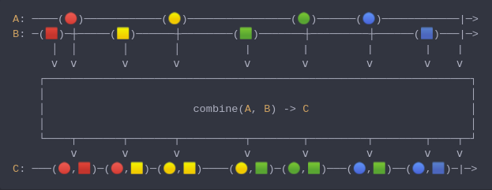

#### [CallbagKit][Callbag] › [Documentation][Documentation] › [Operators][Operators] › [Combining][Combining]
# Combine
> A Callbag [factory][Sources] / [operator][Operators] that combines the latest
> elements from multiple callbag sources (2 or more upto 6), while it deliver
> those sources latest elements as a tuple. And it returns a [listenable][Sources] source.



<!-- ```swift
A: ────(🔴)────────────(🟡)────────────────(🟢)──────(🔵)────────────|─>
B: ─(🟥)─┼─────(🟨)──────┼────────(🟩)───────┼─────────┼──────(🟦)───|─>
      │  │       │       │          |        |         |        |    |
      ⅴ  ⅴ       ⅴ       ⅴ          ⅴ        ⅴ         ⅴ        ⅴ    ⅴ
    ┌──────────────────────────────────────────────────────────────────┐
    │                                                                  │
    │                       combine(A, B) -> C                         │
    │                                                                  │
    └────┬───────┬───────┬──────────┬────────┬─────────┬────────┬────┬─┘
         ⅴ       ⅴ       ⅴ          ⅴ        ⅴ         ⅴ        ⅴ    ⅴ
C: ───(🔴,🟥)─(🔴,🟨)─(🟡,🟨)────(🟡,🟩)─(🟢,🟩)───(🔵,🟩)──(🔵,🟦)─|─>
``` -->

**Examples**

As a factory:

```swift
  let source = combine(interval(.millisecond), interval(.milliseconds(3.5)))

  _ = source
    |> forEach(print) /// (2, 0)
                      /// (3, 0)
                      /// (4, 0)
                      /// (5, 0)
                      /// (6, 0)
                      /// (6, 1)
                      /// (7, 1)
                      /// (8, 1)
                      /// ...
```

As an operator:

```swift
  let source = interval(.millisecond)

  _ = source
    |> combine(interval(.milliseconds(3.5)))
    |> forEach(print) /// (2, 0)
                      /// (3, 0)
                      /// (4, 0)
                      /// (5, 0)
                      /// (6, 0)
                      /// (6, 1)
                      /// (7, 1)
                      /// (8, 1)
                      /// ...
```

[Callbag]: <../../../README.md> (Callbag)
[Documentation]: <../../README.md> (Documentation)
[Operators]: <../README.md> (Operators)
[Combining]: <./README.md> (Combining)

[Sources]: <../../Sources/README.md> (Sources)