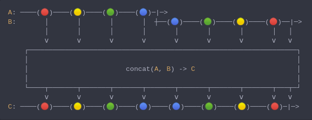

#### [CallbagKit][Callbag] › [Documentation][Documentation] › [Operators][Operators] › [Combining][Combining]
# Concat
> A Callbag [factory][Sources] / [operator][Operators] that concatenates the
> elements from multiple callbag sources (2 or more). It starts each source at
> a time: waits for the previous source to end before starting the next source.
> And it returns a [pullable][Sources] / [listenable][Sources] source, depends
> on the given callbag sources types.



<!-- ```swift
A: ────(🔴)────(🟡)────(🟢)────(🔵)─|─>
B:       │       │       │       │  ┼──(🔵)────(🟢)────(🟡)────(🔴)──|─>
         │       │       │       │       │       │       │       │   │
         ⅴ       ⅴ       ⅴ       ⅴ       ⅴ       ⅴ       ⅴ       ⅴ   ⅴ
    ┌──────────────────────────────────────────────────────────────────┐
    │                                                                  │
    │                        concat(A, B) -> C                         │
    │                                                                  │
    └────┬───────┬───────┬───────┬───────┬───────┬───────┬───────┬───┬─┘
         ⅴ       ⅴ       ⅴ       ⅴ       ⅴ       ⅴ       ⅴ       ⅴ   ⅴ
C: ────(🔴)────(🟡)────(🟢)────(🔵)────(🔵)────(🟢)────(🟡)────(🔴)─|─>
``` -->

**Examples**

As a factory:

```swift
  let source = concat(from(1...4), from(5...8))

  _ = source
    |> forEach(print) /// 1
                      /// 2
                      /// 3
                      /// 4
                      /// 5
                      /// 6
                      /// 7
                      /// 8
```

As an operator:

```swift
  let source = from(1...4)

  _ = source
    |> concat(from(5...8))
    |> forEach(print) /// 1
                      /// 2
                      /// 3
                      /// 4
                      /// 5
                      /// 6
                      /// 7
                      /// 8
```

```swift
  let source = from(1...4)

  _ = source
    |> append(from(5...8))
    |> forEach(print) /// 1
                      /// 2
                      /// 3
                      /// 4
                      /// 5
                      /// 6
                      /// 7
                      /// 8
```

```swift
  let source = from(1...4)

  _ = source
    |> prepend(from(5...8))
    |> forEach(print) /// 5
                      /// 6
                      /// 7
                      /// 8
                      /// 1
                      /// 2
                      /// 3
                      /// 4
```

[Callbag]: <../../../README.md> (Callbag)
[Documentation]: <../../README.md> (Documentation)
[Operators]: <../README.md> (Operators)
[Combining]: <./README.md> (Combining)

[Sources]: <../../Sources/README.md> (Sources)