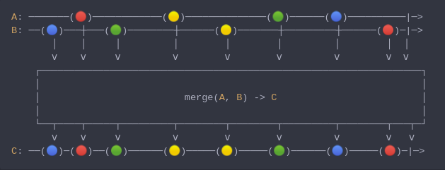

#### [CallbagKit][Callbag] › [Documentation][Documentation] › [Operators][Operators] › [Combining][Combining]
# Merge
> A Callbag [factory][Sources] / [operator][Operators] that merges elements from
> multiple callbag sources. And it returns a [listenable][Sources] source.



<!-- ```swift
A: ───────(🔴)────────────(🟡)──────────────(🟢)──────(🔵)──────────|─>
B: ──(🔵)───┼───(🟢)────────┼──────(🟡)───────┼─────────┼──────(🔴)─|─>
       │    │     │         │        │        │         │        │  │
       ⅴ    ⅴ     ⅴ         ⅴ        ⅴ        ⅴ         ⅴ        ⅴ  ⅴ
    ┌──────────────────────────────────────────────────────────────────┐
    │                                                                  │
    │                         merge(A, B) -> C                         │
    │                                                                  │
    └──┬────┬─────┬─────────┬────────┬────────┬─────────┬────────┬───┬─┘
       ⅴ    ⅴ     ⅴ         ⅴ        ⅴ        ⅴ         ⅴ        ⅴ   ⅴ
C: ──(🔵)─(🔴)──(🟢)──────(🟡)─────(🟡)─────(🟢)──────(🔵)─────(🔴)─|─>
``` -->

**Examples**

As a factory:

```swift
  let source = merge(interval(.millisecond), interval(.milliseconds(3.5)))

  _ = source
    |> forEach(print) /// 0
                      /// 1
                      /// 2
                      /// 0
                      /// 3
                      /// 4
                      /// ...
```

As an operator:

```swift
  let source = of(interval(.millisecond), interval(.milliseconds(3.5)))

  _ = source
    |> merge()
    |> forEach(print) /// 0
                      /// 1
                      /// 2
                      /// 0
                      /// 3
                      /// 4
                      /// ...
```

[Callbag]: <../../../README.md> (Callbag)
[Documentation]: <../../README.md> (Documentation)
[Operators]: <../README.md> (Operators)
[Combining]: <./README.md> (Combining)

[Sources]: <../../Sources/README.md> (Sources)