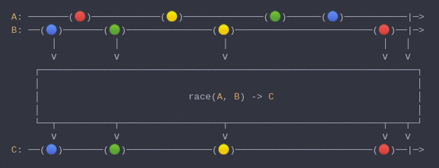

#### [CallbagKit][Callbag] › [Documentation][Documentation] › [Operators][Operators] › [Combining][Combining]
# Race
> A Callbag [factory][Sources] that deliver all elements from only the first
> source that start emitting among multiple callbag sources. And it returns a
> [listenable][Sources] source.



<!-- ```swift
A: ───────(🔴)────────────(🟡)──────────────(🟢)──────(🔵)───────────|─>
B: ──(🔵)───────(🟢)───────────────(🟡)────────────────────────(🔴)──|─>
       │          │                  │                           │   │
       ⅴ          ⅴ                  ⅴ                           ⅴ   ⅴ
    ┌──────────────────────────────────────────────────────────────────┐
    │                                                                  │
    │                          race(A, B) -> C                         │
    │                                                                  │
    └──┬──────────┬──────────────────┬───────────────────────────┬───┬─┘
       ⅴ          ⅴ                  ⅴ                           ⅴ   ⅴ
C: ──(🔵)───────(🟢)───────────────(🟡)────────────────────────(🔴)──|─>
``` -->

**Examples**

As a factory:

```swift
  let a = interval(.millisecond) |> map { "a\($0)" }
  let b = interval(.milliseconds(3.5)) |> map { "b\($0)" }
  let source = race(a, b)

  _ = source
    |> forEach(print) /// a0
                      /// a1
                      /// a2
                      /// a3
                      /// a4
                      /// a5
                      /// ...
```

[Callbag]: <../../../README.md> (Callbag)
[Documentation]: <../../README.md> (Documentation)
[Operators]: <../README.md> (Operators)
[Combining]: <./README.md> (Combining)

[Sources]: <../../Sources/README.md> (Sources)