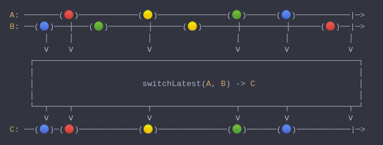

#### [CallbagKit][Callbag] › [Documentation][Documentation] › [Operators][Operators] › [Combining][Combining]
# SwitchLatest
> A Callbag [factory][Sources] / [operator][Operators] that switches values
> to the new source whenever original source emits. And it returns a
> [listenable][Sources] source.



<!-- ```swift
A: ───────(🔴)────────────(🟡)──────────────(🟢)──────(🔵)───────────|─>
B: ──(🔵)───┼───(🟢)────────┼──────(🟡)───────┼─────────┼──────(🔴)──|─>
       │    │               │                 │         │            │
       ⅴ    ⅴ               ⅴ                 ⅴ         ⅴ            ⅴ
    ┌──────────────────────────────────────────────────────────────────┐
    │                                                                  │
    │                      switchLatest(A, B) -> C                     │
    │                                                                  │
    └──┬────┬───────────────┬─────────────────┬─────────┬────────────┬─┘
       ⅴ    ⅴ               ⅴ                 ⅴ         ⅴ            ⅴ
C: ──(🔵)─(🔴)────────────(🟡)──────────────(🟢)──────(🔵)───────────|─>
``` -->

**Examples**

As a factory:

```swift
  let a = interval(.millisecond) |> map { "a\($0)" }
  let b = interval(.milliseconds(3.5)) |> map { "b\($0)" }
  let source = switchLatest(a, b)

  _ = source
    |> forEach(print) /// a0
                      /// a1
                      /// a2
                      /// b0
                      /// b1
                      /// b2
                      /// ...
```

As an operator:

```swift
  let a = interval(.millisecond) |> map { "a\($0)" }
  let b = interval(.milliseconds(3.5)) |> map { "b\($0)" }
  let source = of(a, b)

  _ = source
    |> switchLatest()
    |> forEach(print) /// a0
                      /// a1
                      /// a2
                      /// b0
                      /// b1
                      /// b2
                      /// ...
```

[Callbag]: <../../../README.md> (Callbag)
[Documentation]: <../../README.md> (Documentation)
[Operators]: <../README.md> (Operators)
[Combining]: <./README.md> (Combining)

[Sources]: <../../Sources/README.md> (Sources)