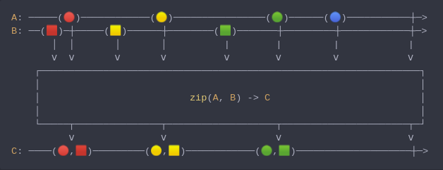

#### [CallbagKit][Callbag] › [Documentation][Documentation] › [Operators][Operators] › [Combining][Combining]
# Zip
> A Callbag [factory][Sources] / [operator][Operators] that combine the emissions
> from multiple callbag sources (2 or more upto 6) together and deliver tuple of
> values for each combination. And it returns a [listenable][Sources] source.



<!-- ```swift
A: ─────(🔴)────────────(🟡)────────────────(🟢)──────(🔵)───────────┼─>
B: ──(🟥)─┼─────(🟨)──────┼────────(🟩)───────┼─────────┼────────────┼─>
       │  │       │       │          |        |         |            |
       ⅴ  ⅴ       ⅴ       ⅴ          ⅴ        ⅴ         ⅴ            ⅴ
    ┌──────────────────────────────────────────────────────────────────┐
    │                                                                  │
    │                          zip(A, B) -> C                          │
    │                                                                  │
    └─────┬───────────────┬───────────────────┬──────────────────────┬─┘
          ⅴ               ⅴ                   ⅴ                      ⅴ
C: ────(🔴,🟥)─────────(🟡,🟨)────────────(🟢,🟩)────────────────────┼─>
``` -->

**Examples**

As a factory:

```swift
  let source = zip(interval(.millisecond), interval(.milliseconds(3.5)))

  _ = source
    |> forEach(print) /// (0, 0)
                      /// (1, 1)
                      /// (2, 2)
                      /// (3, 3)
                      /// (4, 4)
                      /// (5, 5)
                      /// (6, 6)
                      /// (7, 7)
                      /// ...
```

As an operator:

```swift
  let source = interval(.millisecond)

  _ = source
    |> zip(interval(.milliseconds(3.5)))
    |> forEach(print) /// (0, 0)
                      /// (1, 1)
                      /// (2, 2)
                      /// (3, 3)
                      /// (4, 4)
                      /// (5, 5)
                      /// (6, 6)
                      /// (7, 7)
                      /// ...
```

[Callbag]: <../../../README.md> (Callbag)
[Documentation]: <../../README.md> (Documentation)
[Operators]: <../README.md> (Operators)
[Combining]: <./README.md> (Combining)

[Sources]: <../../Sources/README.md> (Sources)