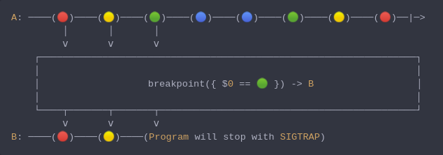

#### [CallbagKit][Callbag] › [Documentation][Documentation] › [Operators][Operators] › [Debugging][Debugging]
# Breakpoint
> A Callbag [operator][Operators] that raises a Trap Signal `SIGTRAP` whenever
> the passed functions return `true`. And it returns a [pullable][Sources] /
> [listenable][Sources] source, depends on the given callbag sources types.



<!-- ```swift
A: ────(🔴)────(🟡)────(🟢)────(🔵)────(🔵)────(🟢)────(🟡)────(🔴)──|─>
         │       │       │
         ⅴ       ⅴ       ⅴ
    ┌──────────────────────────────────────────────────────────────────┐
    │                                                                  │
    │                   breakpoint({ $0 == 🟢 }) -> B                  │
    │                                                                  │
    └────┬───────┬───────┬─────────────────────────────────────────────┘
         ⅴ       ⅴ       ⅴ
B: ────(🔴)────(🟡)────(Program will stop with SIGTRAP)
``` -->

**Examples**

```swift
  let source = from(1...4)

  _ = source
    |> breakpoint(receiveElement: { $0 == 4 })
    |> forEach(print) /// 1
                      /// 2
                      /// 3
                      /// SIGTRAP
```

```swift
  let source = from(1...4)

  _ = source
    |> breakpoint(receiveCompletion: { true })
    |> forEach(print) /// 1
                      /// 2
                      /// 3
                      /// 4
                      /// SIGTRAP
```

```swift
  let source = from(1...4)

  _ = source
    |> breakpoint(
        receiveElement: { $0 > 3 },
        receiveCompletion: {
          if case .failed = $0 {
            print($0)
            return true
          } else {
            return false
          }
        }
      )
    |> forEach(print) /// 1
                      /// 2
                      /// 3
                      /// SIGTRAP
```

[Callbag]: <../../../README.md> (Callbag)
[Documentation]: <../../README.md> (Documentation)
[Operators]: <../README.md> (Operators)
[Debugging]: <./README.md> (Debugging)

[Sources]: <../../Sources/README.md> (Sources)