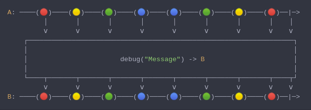

#### [CallbagKit][Callbag] › [Documentation][Documentation] › [Operators][Operators] › [Debugging][Debugging]
# Debug
> A Callbag [operator][Operators] that prints log messages for all events. And
> it returns a [pullable][Sources] / [listenable][Sources] source, depends on
> the given callbag sources types.



<!-- ```swift
A: ────(🔴)────(🟡)────(🟢)────(🔵)────(🔵)────(🟢)────(🟡)────(🔴)──|─>
         │       │       │       │       │       │       │       │    │
         ⅴ       ⅴ       ⅴ       ⅴ       ⅴ       ⅴ       ⅴ       ⅴ    ⅴ
    ┌──────────────────────────────────────────────────────────────────┐
    │                                                                  │
    │                       debug("Message") -> B                      │
    │                                                                  │
    └────┬───────┬───────┬───────┬───────┬───────┬───────┬───────┬────┬┘
         ⅴ       ⅴ       ⅴ       ⅴ       ⅴ       ⅴ       ⅴ       ⅴ    ⅴ
B: ────(🔴)────(🟡)────(🟢)────(🔵)────(🔵)────(🟢)────(🟡)────(🔴)──|─>
``` -->

**Examples**

```swift
_ = from(1...3)
  |> debug()
  |> sink(print) // ≺─ request start((Callbag<Int, Optional<Any>>) -> Void)
                 // ─≻ receive start((Callbag<Optional<Any>, Int>) -> Void)
                 // ≺─ request next(nil)
                 // ─≻ receive next(1)
                 // next(1)
                 // ≺─ request next(nil)
                 // ─≻ receive next(2)
                 // next(2)
                 // ≺─ request next(nil)
                 // ─≻ receive next(3)
                 // next(3)
                 // ≺─ request next(nil)
                 // ─≻ receive completed(finished)
                 // completed(finished)
```

```swift
_ = from(1...3)
  |> debug()
  |> last()
  |> sink(print) // ≺─ request start((Callbag<Int, Optional<Any>>) -> Void)
                 // ─≻ receive start((Callbag<Optional<Any>, Int>) -> Void)
                 // ≺─ request next(nil)
                 // ─≻ receive next(1)
                 // ≺─ request next(nil)
                 // ─≻ receive next(2)
                 // ≺─ request next(nil)
                 // ─≻ receive next(3)
                 // ≺─ request next(nil)
                 // ─≻ receive completed(finished)
                 // next(3)
                 // completed(finished)
```

```swift
_ = from(1...3)
  |> debug("\(Date())", includeArrows: false)
  |> take(2)
  |> sink(print) // 2020-10-03 22:59:23 +0000: request start((Callbag<Int, Optional<Any>>) -> Void)
                 // 2020-10-03 22:59:23 +0000: receive start((Callbag<Optional<Any>, Int>) -> Void)
                 // 2020-10-03 22:59:23 +0000: request next(nil)
                 // 2020-10-03 22:59:24 +0000: receive next(0)
                 // next(0)
                 // 2020-10-03 22:59:24 +0000: request next(nil)
                 // 2020-10-03 22:59:25 +0000: receive next(1)
                 // next(1)
                 // 2020-10-03 22:59:25 +0000: request next(nil)
                 // 2020-10-03 22:59:26 +0000: receive next(2)
                 // 2020-10-03 22:59:26 +0000: request completed(finished)
                 // 2020-10-03 22:59:27 +0000: receive completed(finished)
                 // completed(finished)
```

[Callbag]: <../../../README.md> (Callbag)
[Documentation]: <../../README.md> (Documentation)
[Operators]: <../README.md> (Operators)
[Debugging]: <./README.md> (Debugging)

[Sources]: <../../Sources/README.md> (Sources)