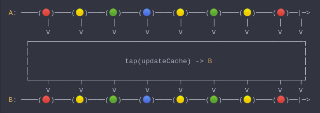

#### [CallbagKit][Callbag] › [Documentation][Documentation] › [Operators][Operators] › [Debugging][Debugging]
# Tap
> A Callbag [operator][Operators] that allows to preform a side-effect whenever
> it receives an event. And it returns a [pullable][Sources] / [listenable][Sources]
> source, depends on the given callbag sources types.



<!-- ```swift
A: ────(🔴)────(🟡)────(🟢)────(🔵)────(🟡)────(🟢)────(🟡)────(🔴)──|─>
         │       │       │       │       │       │       │       │    │
         ⅴ       ⅴ       ⅴ       ⅴ       ⅴ       ⅴ       ⅴ       ⅴ    ⅴ
    ┌──────────────────────────────────────────────────────────────────┐
    │                                                                  │
    │                       tap(updateCache) -> B                      │
    │                                                                  │
    └────┬───────┬───────┬───────┬───────┬───────┬───────┬───────┬────┬┘
         ⅴ       ⅴ       ⅴ       ⅴ       ⅴ       ⅴ       ⅴ       ⅴ    ⅴ
B: ────(🔴)────(🟡)────(🟢)────(🔵)────(🟡)────(🟢)────(🟡)────(🔴)──|─>
``` -->

**Examples**

```swift
  let source = from(1...4)

  _ = source
    |> tap(receiveElement: print)
    |> forEach({ _ in }) /// 1
                         /// 2
                         /// 3
                         /// 4
```

```swift
  let source = from(1...4)

  _ = source
    |> tap(receiveCompletion: print)
    |> forEach({ _ in }) /// completed(.finished)
```

[Callbag]: <../../../README.md> (Callbag)
[Documentation]: <../../README.md> (Documentation)
[Operators]: <../README.md> (Operators)
[Debugging]: <./README.md> (Debugging)

[Sources]: <../../Sources/README.md> (Sources)