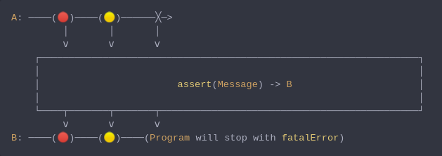

#### [CallbagKit][Callbag] › [Documentation][Documentation] › [Operators][Operators] › [ErrorHandling][ErrorHandling]
# Assert
> A Callbag [operator][Operators] that raises a fatal errpr `fatalError` whenever
> the source deliver an error. And it returns a [pullable][Sources] /
> [listenable][Sources] source, depends on the given callbag sources types.



<!-- ```swift
A: ────(🔴)────(🟡)──────╳─>
         │       │       │
         ⅴ       ⅴ       ⅴ
    ┌──────────────────────────────────────────────────────────────────┐
    │                                                                  │
    │                        assert(Message) -> B                      │
    │                                                                  │
    └────┬───────┬───────┬─────────────────────────────────────────────┘
         ⅴ       ⅴ       ⅴ
B: ────(🔴)────(🟡)────(Program will stop with fatalError)
``` -->

**Examples**

```swift
  public enum SubjectError: Error {
    case genericSubjectError
  }

  let subject: Subject<String> = makeSubject(.behavior("initial value"))

  _ = from(subject)
    |> assert()
    |> forEach(print("value: "))

  subject(.next("second value"))
  subject(.completed(.failed(SubjectError.genericSubjectError)))

  // Prints:
  //  value: initial value.
  //  value: second value.
  //  The process then terminates in the debugger as the assert operator catches the genericSubjectError.
```

[Callbag]: <../../../README.md> (Callbag)
[Documentation]: <../../README.md> (Documentation)
[Operators]: <../README.md> (Operators)
[ErrorHandling]: <./README.md> (ErrorHandling)

[Sources]: <../../Sources/README.md> (Sources)