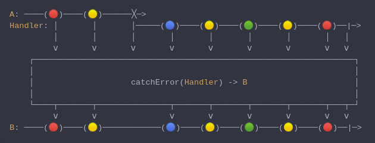

#### [CallbagKit][Callbag] › [Documentation][Documentation] › [Operators][Operators] › [ErrorHandling][ErrorHandling]
# CatchError
> A Callbag [operator][Operators] that raises a fatal errpr `fatalError` whenever
> the source deliver an error. And it returns a [pullable][Sources] /
> [listenable][Sources] source, depends on the given callbag sources types.



<!-- ```swift
A: ────(🔴)────(🟡)──────╳─>
Handler: │       │       │─────(🔵)────(🟡)────(🟢)────(🟡)────(🔴)──|─>
         │       │       │       │       │       │       │       │   │
         ⅴ       ⅴ       ⅴ       ⅴ       ⅴ       ⅴ       ⅴ       ⅴ   ⅴ
    ┌──────────────────────────────────────────────────────────────────┐
    │                                                                  │
    │                    catchError(Handler) -> B                      │
    │                                                                  │
    └────┬───────┬───────────────┬───────┬───────┬───────┬───────┬───┬─┘
         ⅴ       ⅴ               ⅴ       ⅴ       ⅴ       ⅴ       ⅴ   ⅴ
B: ────(🔴)────(🟡)────────────(🔵)────(🟡)────(🟢)────(🟡)────(🔴)──|─>
``` -->

**Examples**

```swift
  public enum SubjectError: Error {
    case genericSubjectError
  }

  let subject: Subject<String> = makeSubject(.behavior("initial value"))

  _ = from(subject)
    |> catchError {
      if $0 is SubjectError {
        return just("third value")
      } else {
        return throwError($0)
      }
    }
    |> forEach(print("value: "))

  subject(.next("second value"))
  subject(.completed(.failed(SubjectError.genericSubjectError)))

  // Prints:
  //  value: initial value.
  //  value: second value.
  //  value: third value.
```

[Callbag]: <../../../README.md> (Callbag)
[Documentation]: <../../README.md> (Documentation)
[Operators]: <../README.md> (Operators)
[ErrorHandling]: <./README.md> (ErrorHandling)

[Sources]: <../../Sources/README.md> (Sources)