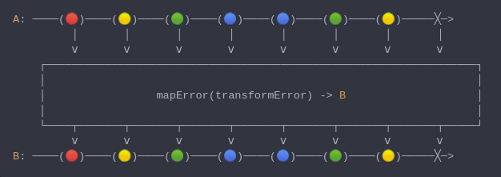

#### [CallbagKit][Callbag] › [Documentation][Documentation] › [Operators][Operators] › [ErrorHandling][ErrorHandling]
# MapError
> A Callbag [operator][Operators] that transform an error to another error. And
> it returns a [pullable][Sources] / [listenable][Sources] source, depends on the
> given callbag sources types.



<!-- ```swift
A: ────(🔴)────(🟡)────(🟢)────(🔵)────(🔵)────(🟢)────(🟡)─────╳─>
         │       │       │       │       │       │       │       │
         ⅴ       ⅴ       ⅴ       ⅴ       ⅴ       ⅴ       ⅴ       ⅴ
    ┌──────────────────────────────────────────────────────────────────┐
    │                                                                  │
    │                 mapError(transformError) -> B                    │
    │                                                                  │
    └────┬───────┬───────┬───────┬───────┬───────┬───────┬───────┬─────┘
         ⅴ       ⅴ       ⅴ       ⅴ       ⅴ       ⅴ       ⅴ       ⅴ
B: ────(🔴)────(🟡)────(🟢)────(🔵)────(🔵)────(🟢)────(🟡)─────╳─>
``` -->

**Examples**

```swift
  struct DivisionByZeroError: Error {}
  struct MyGenericError: Error { var wrappedError: Error }

  func myDivide(_ dividend: Double, _ divisor: Double) throws -> Double {
    guard divisor != 0 else { throw DivisionByZeroError() }
    return dividend / divisor
  }

  _ = of(5, 4, 3, 2, 1, 0)
    |> map { try myDivide(1, $0) }
    |> mapError { MyGenericError(wrappedError: $0) }
    |> sink(print) // next(0.2)
                   // next(0.25)
                   // next(0.3333333333333333)
                   // next(0.5)
                   // next(1.0)
                   // completed(failed(MyGenericError(wrappedError: DivisionByZeroError())))
```

[Callbag]: <../../../README.md> (Callbag)
[Documentation]: <../../README.md> (Documentation)
[Operators]: <../README.md> (Operators)
[ErrorHandling]: <./README.md> (ErrorHandling)

[Sources]: <../../Sources/README.md> (Sources)