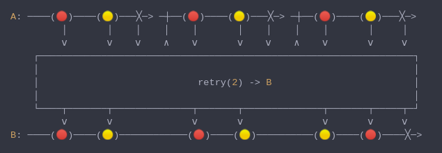

#### [CallbagKit][Callbag] › [Documentation][Documentation] › [Operators][Operators] › [ErrorHandling][ErrorHandling]
# Retry
> A Callbag [operator][Operators] that will restart the source whenever the source
> deliver an error. And it returns a [pullable][Sources] / [listenable][Sources]
> source, depends on the given callbag sources types.



<!-- ```swift
A: ────(🔴)────(🟡)───╳─> ─┼──(🔴)────(🟡)───╳─> ─┼──(🔴)────(🟡)───╳─>
         │       │    │    │    │       │    │    │    │       │     │
         ⅴ       ⅴ    ⅴ    ∧    ⅴ       ⅴ    ⅴ    ∧    ⅴ       ⅴ     ⅴ
    ┌──────────────────────────────────────────────────────────────────┐
    │                                                                  │
    │                            retry(2) -> B                         │
    │                                                                  │
    └────┬───────┬──────────────┬───────┬──────────────┬───────┬─────┬─┘
         ⅴ       ⅴ              ⅴ       ⅴ              ⅴ       ⅴ     ⅴ
B: ────(🔴)────(🟡)────────────(🔴)────(🟡)──────────(🟡)────(🔴)────╳─>
``` -->

**Examples**

```swift
  public enum SubjectError: Error {
    case genericSubjectError
  }

  let subject: Subject<String> = makeSubject(.behavior("initial value"))

  _ = from(subject)
    |> retry(2)
    |> sink(print)

  subject(.next("second value"))
  subject(.completed(.failed(SubjectError.genericSubjectError)))

  // Prints:
  //  next("initial value")
  //  next("second value")
  //  next("initial value")
  //  next("second value")
  //  next("initial value")
  //  next("second value")
  //  completed(.failed(SubjectError.genericSubjectError))
```

[Callbag]: <../../../README.md> (Callbag)
[Documentation]: <../../README.md> (Documentation)
[Operators]: <../README.md> (Operators)
[ErrorHandling]: <./README.md> (ErrorHandling)

[Sources]: <../../Sources/README.md> (Sources)