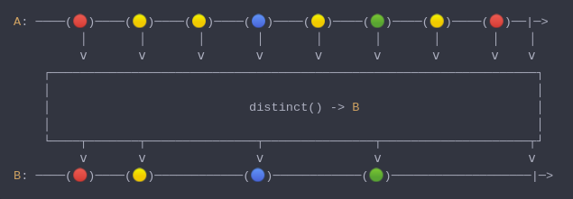
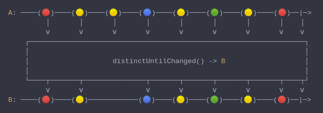

#### [CallbagKit][Callbag] › [Documentation][Documentation] › [Operators][Operators] › [Filtering][Filtering]
# Distincting
> A collection of callbag operators that will suppress duplicate values emitted from source in two ways.

- [Distincting](#distincting)
  - [Distinct](#distinct)
  - [DistinctUntilChanged](#distinctuntilchanged)

## Distinct
> A Callbag [operator][Operators] that will skip repeated elements act as `unique`
> function when applied to a set. And it returns a [pullable][Sources] /
> [listenable][Sources] source, depends on the given callbag sources types.



<!-- ```swift
A: ────(🔴)────(🟡)────(🟡)────(🔵)────(🟡)────(🟢)────(🟡)────(🔴)──|─>
         │       │       │       │       │       │       │       │    │
         ⅴ       ⅴ       ⅴ       ⅴ       ⅴ       ⅴ       ⅴ       ⅴ    ⅴ
    ┌──────────────────────────────────────────────────────────────────┐
    │                                                                  │
    │                           distinct() -> B                        │
    │                                                                  │
    └────┬───────┬───────────────┬───────────────┬────────────────────┬┘
         ⅴ       ⅴ               ⅴ               ⅴ                    ⅴ
B: ────(🔴)────(🟡)────────────(🔵)────────────(🟢)───────────────────|─>
``` -->

**Examples**

```swift
  let source = of(1, 2, 3, 3, 2, 5, 6, 8)

  _ = source
    |> distinct()
    |> forEach(print) // 1
                      // 2
                      // 3
                      // 5
                      // 6
                      // 8
```

---

## DistinctUntilChanged
> A Callbag [operator][Operators] that will skip repeated elements until the
> repetition pattern stops. And it returns a [pullable][Sources] /
> [listenable][Sources] source, depends on the given callbag sources types.



<!-- ```swift
A: ────(🔴)────(🟡)────(🟡)────(🔵)────(🟡)────(🟢)────(🟡)────(🔴)──|─>
         │       │       │       │       │       │       │       │    │
         ⅴ       ⅴ       ⅴ       ⅴ       ⅴ       ⅴ       ⅴ       ⅴ    ⅴ
    ┌──────────────────────────────────────────────────────────────────┐
    │                                                                  │
    │                    distinctUntilChanged() -> B                   │
    │                                                                  │
    └────┬───────┬───────────────┬───────┬───────┬───────┬───────┬────┬┘
         ⅴ       ⅴ               ⅴ       ⅴ       ⅴ       ⅴ       ⅴ    ⅴ
B: ────(🔴)────(🟡)────────────(🔵)────(🟡)────(🟢)────(🟡)────(🔴)──|─>
``` -->

**Examples**

```swift
  let source = of(1, 2, 3, 3, 2, 5, 6, 8)

  _ = source
    |> distinctUntilChanged()
    |> forEach(print) // 1
                      // 2
                      // 3
                      // 2
                      // 5
                      // 6
                      // 8
```

[Callbag]: <../../../README.md> (Callbag)
[Documentation]: <../../README.md> (Documentation)
[Operators]: <../README.md> (Operators)
[Filtering]: <./README.md> (Filtering)

[Sources]: <../../Sources/README.md> (Sources)