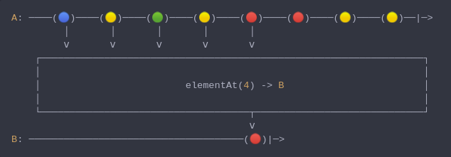

#### [CallbagKit][Callbag] › [Documentation][Documentation] › [Operators][Operators] › [Filtering][Filtering]
# ElementAt
> A Callbag [operator][Operators] that will emit only the element at specified
> index. And it returns a [single][Sources] source.



<!-- ```swift
A: ────(🔵)────(🟡)────(🟢)────(🟡)────(🔴)────(🔴)────(🟡)────(🟡)──|─>
         │       │       │       │       │
         ⅴ       ⅴ       ⅴ       ⅴ       ⅴ
    ┌──────────────────────────────────────────────────────────────────┐
    │                                                                  │
    │                         elementAt(4) -> B                        │
    │                                                                  │
    └────────────────────────────────────┬─────────────────────────────┘
                                         ⅴ
B: ─────────────────────────────────────(🔴)|─>
``` -->

**Examples**

```swift
  let source = from(1...10)

  _ = source
    |> elementAt(4)
    |> forEach(print) // 5
```

[Callbag]: <../../../README.md> (Callbag)
[Documentation]: <../../README.md> (Documentation)
[Operators]: <../README.md> (Operators)
[Filtering]: <./README.md> (Filtering)

[Sources]: <../../Sources/README.md> (Sources)