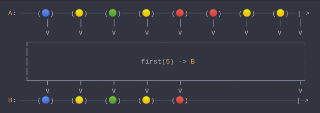

#### [CallbagKit][Callbag] › [Documentation][Documentation] › [Operators][Operators] › [Filtering][Filtering]
# First
> A Callbag [operator][Operators] that will first the first n of elements. And
> it returns a [pullable][Sources] / [listenable][Sources] source, depends on
> the given callbag sources types.



<!-- ```swift
A: ────(🔵)────(🟡)────(🟢)────(🟡)────(🔴)────(🔴)────(🟡)────(🟡)──|─>
         │       │       │       │       │       │       │       │    │
         ⅴ       ⅴ       ⅴ       ⅴ       ⅴ       ⅴ       ⅴ       ⅴ    ⅴ
    ┌──────────────────────────────────────────────────────────────────┐
    │                                                                  │
    │                           first(5) -> B                          │
    │                                                                  │
    └────┬───────┬───────┬───────┬───────┬────────────────────────────┬┘
         ⅴ       ⅴ       ⅴ       ⅴ       ⅴ                            ⅴ
B: ────(🔵)────(🟡)────(🟢)────(🟡)────(🔴)──────────────────────────|─>
``` -->

**Examples**

```swift
  let source = from(0...5)

  _ = source
    |> first()
    |> forEach(print) // 0
```

```swift
  let source = from(0...5)

  _ = source
    |> first(3)
    |> forEach(print) // 0
                      // 1
                      // 2
```

[Callbag]: <../../../README.md> (Callbag)
[Documentation]: <../../README.md> (Documentation)
[Operators]: <../README.md> (Operators)
[Filtering]: <./README.md> (Filtering)

[Sources]: <../../Sources/README.md> (Sources)