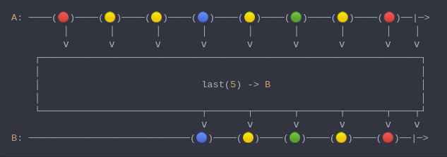

#### [CallbagKit][Callbag] › [Documentation][Documentation] › [Operators][Operators] › [Filtering][Filtering]
# Last
> A Callbag [operator][Operators] that will take the last n of elements. And it
> returns a [listenable][Sources].



<!-- ```swift
A: ────(🔴)────(🟡)────(🟡)────(🔵)────(🟡)────(🟢)────(🟡)────(🔴)──|─>
         │       │       │       │       │       │       │       │    │
         ⅴ       ⅴ       ⅴ       ⅴ       ⅴ       ⅴ       ⅴ       ⅴ    ⅴ
    ┌──────────────────────────────────────────────────────────────────┐
    │                                                                  │
    │                            last(5) -> B                          │
    │                                                                  │
    └────────────────────────────┬───────┬───────┬───────┬───────┬────┬┘
                                 ⅴ       ⅴ       ⅴ       ⅴ       ⅴ    ⅴ
B: ────────────────────────────(🔵)────(🟡)────(🟢)────(🟡)────(🔴)──|─>
``` -->

**Examples**

```swift
  let source = from(0...5)

  _ = source
    |> last()
    |> forEach(print) // 5
```

```swift
  let source = from(0...5)

  _ = source
    |> last(3)
    |> forEach(print) // 3
                      // 4
                      // 5
```

[Callbag]: <../../../README.md> (Callbag)
[Documentation]: <../../README.md> (Documentation)
[Operators]: <../README.md> (Operators)
[Filtering]: <./README.md> (Filtering)

[Sources]: <../../Sources/README.md> (Sources)