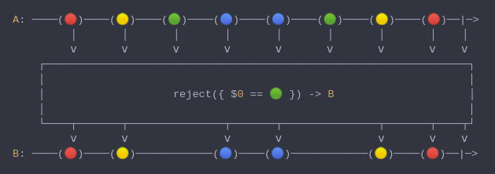

#### [CallbagKit][Callbag] › [Documentation][Documentation] › [Operators][Operators] › [Filtering][Filtering]
# Reject
> A Callbag [operator][Operators] that will emit only the elements that DON'T meet
> a certain condition. And it returns a [pullable][Sources] / [listenable][Sources]
> source, depends on the given callbag sources types.



<!-- ```swift
A: ────(🔴)────(🟡)────(🟢)────(🔵)────(🔵)────(🟢)────(🟡)────(🔴)──|─>
         │       │       │       │       │       │       │       │    │
         ⅴ       ⅴ       ⅴ       ⅴ       ⅴ       ⅴ       ⅴ       ⅴ    ⅴ
    ┌──────────────────────────────────────────────────────────────────┐
    │                                                                  │
    │                    reject({ $0 == 🟢 }) -> B                     │
    │                                                                  │
    └────┬───────┬───────────────┬───────┬───────────────┬───────┬────┬┘
         ⅴ       ⅴ               ⅴ       ⅴ               ⅴ       ⅴ    ⅴ
B: ────(🔴)────(🟡)────────────(🔵)────(🔵)────────────(🟡)────(🔴)──|─>
``` -->

**Examples**

```swift
  let source = from(1...10)

  _ = source
    |> reject({ $0 % 2 == 0 })
    |> forEach(print) // 1
                      // 3
                      // 5
                      // 7
                      // 9
```

[Callbag]: <../../../README.md> (Callbag)
[Documentation]: <../../README.md> (Documentation)
[Operators]: <../README.md> (Operators)
[Filtering]: <./README.md> (Filtering)

[Sources]: <../../Sources/README.md> (Sources)