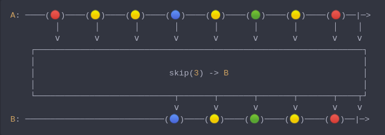
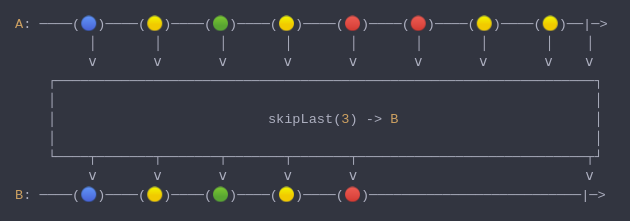
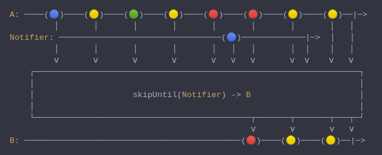
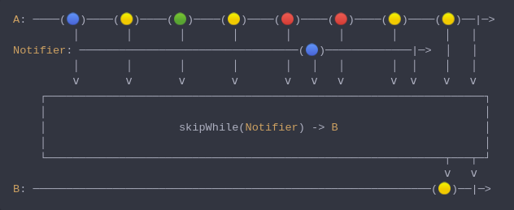
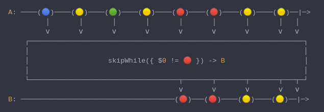

#### [CallbagKit][Callbag] › [Documentation][Documentation] › [Operators][Operators] › [Filtering][Filtering]

# Skipping
> A collection of callbag operators that will skip emitting elements in variate ways.

- [Skipping](#skipping)
  - [Skip](#skip)
  - [SkipLast](#skiplast)
  - [SkipUntil](#skipuntil)
  - [SkipWhile](#skipwhile)
  - [SkipWhile](#skipwhile-1)

---

## Skip
> A Callbag [operator][Operators] that will skip the first n of elements. And it
> returns a [pullable][Sources] / [listenable][Sources] source, depends on the
> given callbag sources types.



<!-- ```swift
A: ────(🔴)────(🟡)────(🟡)────(🔵)────(🟡)────(🟢)────(🟡)────(🔴)──|─>
         │       │       │       │       │       │       │       │    │
         ⅴ       ⅴ       ⅴ       ⅴ       ⅴ       ⅴ       ⅴ       ⅴ    ⅴ
    ┌──────────────────────────────────────────────────────────────────┐
    │                                                                  │
    │                           skip(3) -> B                           │
    │                                                                  │
    └────────────────────────────┬───────┬───────┬───────┬───────┬────┬┘
                                 ⅴ       ⅴ       ⅴ       ⅴ       ⅴ    ⅴ
B: ────────────────────────────(🔵)────(🟡)────(🟢)────(🟡)────(🔴)──|─>
``` -->

**Examples**

```swift
  let source = from(0...5)

  _ = source
    |> skip(3)
    |> forEach(print) // 3
                      // 4
                      // 5
```

---

## SkipLast
> A Callbag [operator][Operators] that will skip the last n of elements. And it
> returns a [pullable][Sources] / [listenable][Sources] source, depends on the
> given callbag sources types.



<!-- ```swift
A: ────(🔵)────(🟡)────(🟢)────(🟡)────(🔴)────(🔴)────(🟡)────(🟡)──|─>
         │       │       │       │       │       │       │       │    │
         ⅴ       ⅴ       ⅴ       ⅴ       ⅴ       ⅴ       ⅴ       ⅴ    ⅴ
    ┌──────────────────────────────────────────────────────────────────┐
    │                                                                  │
    │                          skipLast(3) -> B                        │
    │                                                                  │
    └────┬───────┬───────┬───────┬───────┬────────────────────────────┬┘
         ⅴ       ⅴ       ⅴ       ⅴ       ⅴ                            ⅴ
B: ────(🔵)────(🟡)────(🟢)────(🟡)────(🔴)──────────────────────────|─>
``` -->

**Examples**

```swift
  let source = from(0...5)

  _ = source
    |> skipLast(3)
    |> forEach(print) // 0
                      // 1
                      // 2
```

---

## SkipUntil
> A Callbag [operator][Operators] that will skip the first n of elements, until
> a notifier callbag source emit a value. And it returns a [pullable][Sources] /
> [listenable][Sources] source, depends on the given callbag sources types.



<!-- ```swift
A: ────(🔵)────(🟡)────(🟢)────(🟡)────(🔴)────(🔴)────(🟡)────(🟡)──|─>
         │       │       │       │       │       │       │       │   │
Notifier: ─────────────────────────────────(🔵)─────────────|─>  │   │
         │       │       │       │       │   │   │       │  │    │   │
         ⅴ       ⅴ       ⅴ       ⅴ       ⅴ   ⅴ   ⅴ       ⅴ  ⅴ    ⅴ   ⅴ
    ┌──────────────────────────────────────────────────────────────────┐
    │                                                                  │
    │                    skipUntil(Notifier) -> B                      │
    │                                                                  │
    └────────────────────────────────────────────┬───────┬───────┬───┬─┘
                                                 ⅴ       ⅴ       ⅴ   ⅴ
B: ────────────────────────────────────────────(🔴)────(🟡)────(🟡)──|─>
``` -->

**Note**
> If the notifier completes without emitting any value (i.e.: callbag-empty)
> the source callbag will NOT be terminated, nor will emit any value.

**Examples**

```swift
  let source = interval(.second)
  let notifier = empty() |> delay(.seconds(2)) // will emit completion after 2 seconds

  _ = source
    |> skipUntil(notifier) // will skip all emission
    |> take(5)
    |> forEach(print) // will print nothing
```

```swift
  let source = interval(.second)
  let notifier = interval(.seconds(2)) // will emit `next(0)` after 2 seconds

  _ = source
    |> skipUntil(notifier) // will skip the first emission
    |> take(5)
    |> forEach(print) // 1
                      // 2
                      // 3
                      // 4
                      // 5
```

---

## SkipWhile
> A Callbag [operator][Operators] that will skip the first n of elements, until a
> notifier callbag source emit a completion. And it returns a [pullable][Sources] /
> [listenable][Sources] source, depends on the given callbag sources types.



<!-- ```swift
A: ────(🔵)────(🟡)────(🟢)────(🟡)────(🔴)────(🔴)────(🟡)────(🟡)──|─>
         │       │       │       │       │       │       │       │   │
Notifier: ─────────────────────────────────(🔵)─────────────|─>  │   │
         │       │       │       │       │   │   │       │  │    │   │
         ⅴ       ⅴ       ⅴ       ⅴ       ⅴ   ⅴ   ⅴ       ⅴ  ⅴ    ⅴ   ⅴ
    ┌──────────────────────────────────────────────────────────────────┐
    │                                                                  │
    │                    skipWhile(Notifier) -> B                      │
    │                                                                  │
    └────────────────────────────────────────────────────────────┬───┬─┘
                                                                 ⅴ   ⅴ
B: ────────────────────────────────────────────────────────────(🟡)──|─>
``` -->

**Examples**

```swift
  let source = interval(.second)
  let notifier = empty() |> delay(.seconds(2)) // will emit completion after 2 seconds

  _ = source
    |> skipWhile(notifier) // will skip the first emission
    |> take(5)
    |> forEach(print) // 1
                      // 2
                      // 3
                      // 4
                      // 5
```

---

## SkipWhile
> A Callbag [operator][Operators] that will skip the first n of elements,
> until passed closure return false. And it returns a [pullable][Sources] /
> [listenable][Sources] source, depends on the given callbag sources types.



<!-- ```swift
A: ────(🔵)────(🟡)────(🟢)────(🟡)────(🔴)────(🔴)────(🟡)────(🟡)──|─>
         │       │       │       │       │       │       │       │   │
         ⅴ       ⅴ       ⅴ       ⅴ       ⅴ       ⅴ       ⅴ       ⅴ   ⅴ
    ┌──────────────────────────────────────────────────────────────────┐
    │                                                                  │
    │                   skipWhile({ $0 != 🔴 }) -> B                   │
    │                                                                  │
    └────────────────────────────────────┬───────┬───────┬───────┬───┬─┘
                                         ⅴ       ⅴ       ⅴ       ⅴ   ⅴ
B: ─────────────────────────────────────(🔴)───(🔴)────(🟡)────(🟡)──|─>
``` -->

**Examples**

```swift
  let source = of(1, 2, 3, 4, 5, 1, 3, 5, 7)

  _ = source
    |> skipWhile { $0 < 5}
    |> forEach(print) // 5
                      // 1
                      // 3
                      // 5
                      // 7
```


[Callbag]: <../../../README.md> (Callbag)
[Documentation]: <../../README.md> (Documentation)
[Operators]: <../README.md> (Operators)
[Filtering]: <./README.md> (Filtering)

[Sources]: <../../Sources/README.md> (Sources)