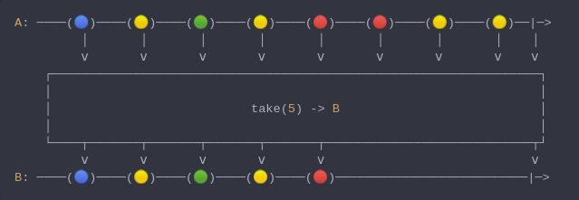
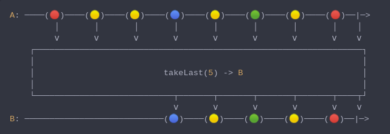
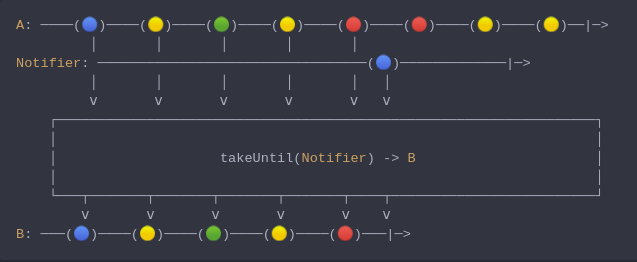
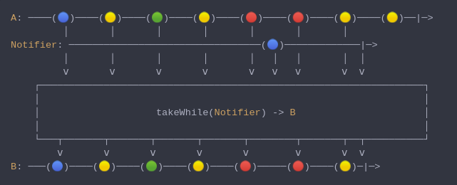
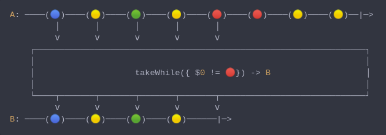

#### [CallbagKit][Callbag] › [Documentation][Documentation] › [Operators][Operators] › [Filtering][Filtering]

# Taking
> A collection of callbag operators that will take emitting elements in variate ways.

- [Taking](#taking)
  - [Take](#take)
  - [TakeLast](#takelast)
  - [TakeUntil](#takeuntil)
  - [TakeWhile](#takewhile)
  - [TakeWhile](#takewhile-1)

---

## Take
> A Callbag [operator][Operators] that will take the first n of elements. And
> it returns a [pullable][Sources] / [listenable][Sources] source, depends on
> the given callbag sources types.



<!-- ```swift
A: ────(🔵)────(🟡)────(🟢)────(🟡)────(🔴)────(🔴)────(🟡)────(🟡)──|─>
         │       │       │       │       │       │       │       │    │
         ⅴ       ⅴ       ⅴ       ⅴ       ⅴ       ⅴ       ⅴ       ⅴ    ⅴ
    ┌──────────────────────────────────────────────────────────────────┐
    │                                                                  │
    │                           take(5) -> B                           │
    │                                                                  │
    └────┬───────┬───────┬───────┬───────┬────────────────────────────┬┘
         ⅴ       ⅴ       ⅴ       ⅴ       ⅴ                            ⅴ
B: ────(🔵)────(🟡)────(🟢)────(🟡)────(🔴)──────────────────────────|─>
``` -->

**Examples**

```swift
  let source = from(0...5)

  _ = source
    |> take(3)
    |> forEach(print) // 0
                      // 1
                      // 2
```

---

## TakeLast
> A Callbag [operator][Operators] that will take the last n of elements. And it
> returns a [listenable][Sources].



<!-- ```swift
A: ────(🔴)────(🟡)────(🟡)────(🔵)────(🟡)────(🟢)────(🟡)────(🔴)──|─>
         │       │       │       │       │       │       │       │    │
         ⅴ       ⅴ       ⅴ       ⅴ       ⅴ       ⅴ       ⅴ       ⅴ    ⅴ
    ┌──────────────────────────────────────────────────────────────────┐
    │                                                                  │
    │                          takeLast(5) -> B                        │
    │                                                                  │
    └────────────────────────────┬───────┬───────┬───────┬───────┬────┬┘
                                 ⅴ       ⅴ       ⅴ       ⅴ       ⅴ    ⅴ
B: ────────────────────────────(🔵)────(🟡)────(🟢)────(🟡)────(🔴)──|─>
``` -->

**Examples**

```swift
  let source = from(0...5)

  _ = source
    |> takeLast(3)
    |> forEach(print) // 3
                      // 4
                      // 5
```

---

## TakeUntil
> A Callbag [operator][Operators] that will take the first n of elements, until
> a notifier callbag source emit a value. And it returns a [pullable][Sources] /
> [listenable][Sources] source, depends on the given callbag sources types.



<!-- ```swift
A: ────(🔵)────(🟡)────(🟢)────(🟡)────(🔴)────(🔴)────(🟡)────(🟡)──|─>
         │       │       │       │       │
Notifier: ─────────────────────────────────(🔵)─────────────|─>
         │       │       │       │       │   │
         ⅴ       ⅴ       ⅴ       ⅴ       ⅴ   ⅴ
    ┌──────────────────────────────────────────────────────────────────┐
    │                                                                  │
    │                    takeUntil(Notifier) -> B                      │
    │                                                                  │
    └───┬───────┬───────┬───────┬───────┬────┬─────────────────────────┘
        ⅴ       ⅴ       ⅴ       ⅴ       ⅴ    ⅴ
B: ───(🔵)────(🟡)────(🟢)────(🟡)────(🔴)───|─>
``` -->

**Note**
> If the notifier completes without emitting any value (i.e.: callbag-empty)
> the source callbag will take all values.

**Examples**

```swift
  let source = interval(.second)
  let notifier = empty() |> delay(.seconds(2)) // will emit completion after 2 seconds

  _ = source
    |> takeUntil(notifier) // will take all emission
    |> forEach(print) // 0
                      // 1
                      // 2
                      // ...
```

```swift
  let source = interval(.second)
  let notifier = interval(.seconds(2)) // will emit `next(0)` after 2 seconds

  _ = source
    |> takeUntil(notifier) // will take the first emission
    |> forEach(print) // 0
```

---

## TakeWhile
> A Callbag [operator][Operators] that will take the first n of elements, until
> a notifier callbag source emit a completion. And it returns a [pullable][Sources] /
> [listenable][Sources] source, depends on the given callbag sources types.



<!-- ```swift
A: ────(🔵)────(🟡)────(🟢)────(🟡)────(🔴)────(🔴)────(🟡)────(🟡)──|─>
         │       │       │       │       │       │       │
Notifier: ─────────────────────────────────(🔵)─────────────|─>
         │       │       │       │       │   │   │       │  │
         ⅴ       ⅴ       ⅴ       ⅴ       ⅴ   ⅴ   ⅴ       ⅴ  ⅴ
    ┌──────────────────────────────────────────────────────────────────┐
    │                                                                  │
    │                    takeWhile(Notifier) -> B                      │
    │                                                                  │
    └───┬───────┬───────┬───────┬───────┬────────┬───────┬──┬──────────┘
        ⅴ       ⅴ       ⅴ       ⅴ       ⅴ        ⅴ       ⅴ  ⅴ
B: ───(🔵)────(🟡)────(🟢)────(🟡)────(🔴)─────(🔴)────(🟡)─|─>
``` -->

```swift
  let source = interval(.second)
  let notifier = empty() |> delay(.seconds(3)) // will emit completion after 3 seconds

  _ = source
    |> takeWhile(notifier) // will take the first 2 emission
    |> forEach(print) // 0
                      // 1
```

---

## TakeWhile
> A Callbag [operator][Operators] that will take the first n of elements, until
> passed closure return false. And it returns a [pullable][Sources] / [listenable][Sources]
> source, depends on the given callbag sources types.



<!-- ```swift
A: ────(🔵)────(🟡)────(🟢)────(🟡)────(🔴)────(🔴)────(🟡)────(🟡)──|─>
         │       │       │       │       │
         ⅴ       ⅴ       ⅴ       ⅴ       ⅴ
    ┌──────────────────────────────────────────────────────────────────┐
    │                                                                  │
    │                    takeWhile({ $0 != 🔴}) -> B                   │
    │                                                                  │
    └────┬───────┬───────┬───────┬───────┬─────────────────────────────┘
         ⅴ       ⅴ       ⅴ       ⅴ       ⅴ
B: ────(🔵)────(🟡)────(🟢)────(🟡)──────|─>
``` -->

**Examples**

```swift
  let source = of(1, 2, 3, 4, 5, 1, 3, 5, 7)

  _ = source
    |> takeWhile { $0 < 5}
    |> forEach(print) // 5
                      // 1
                      // 3
                      // 5
                      // 7
```

[Callbag]: <../../../README.md> (Callbag)
[Documentation]: <../../README.md> (Documentation)
[Operators]: <../README.md> (Operators)
[Filtering]: <./README.md> (Filtering)

[Sources]: <../../Sources/README.md> (Sources)