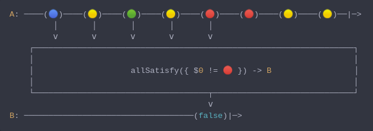

#### [CallbagKit][Callbag] › [Documentation][Documentation] › [Operators][Operators] › [Matching][Matching]
# AllSatisfy
> A Callbag [operator][Operators] that will determine whether all items emitted
> from source meet some criteria. And it returns a [single][Sources] source.



<!-- ```swift
A: ────(🔵)────(🟡)────(🟢)────(🟡)────(🔴)────(🔴)────(🟡)────(🟡)──|─>
         │       │       │       │       │
         ⅴ       ⅴ       ⅴ       ⅴ       ⅴ
    ┌──────────────────────────────────────────────────────────────────┐
    │                                                                  │
    │                    allSatisfy({ $0 != 🔴 }) -> B                 │
    │                                                                  │
    └────────────────────────────────────┬─────────────────────────────┘
                                         ⅴ
B: ───────────────────────────────────(false)|─>
``` -->

**Examples**

```swift
  let source = from(1...10)

  _ = source
    |> allSatisfy({ $0 % 2 == 0 })
    |> forEach(print) // false
```

[Callbag]: <../../../README.md> (Callbag)
[Documentation]: <../../README.md> (Documentation)
[Operators]: <../README.md> (Operators)
[Matching]: <./README.md> (Matching)

[Sources]: <../../Sources/README.md> (Sources)