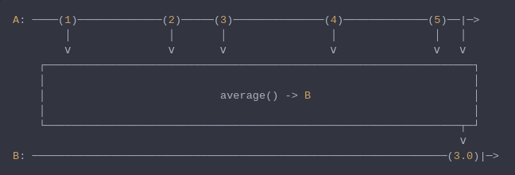

#### [CallbagKit][Callbag] › [Documentation][Documentation] › [Operators][Operators] › [Mathematical][Mathematical]
# Average
> A Callbag [operator][Operators] that will calculates the average of numbers
> emitted by a source and emits this average. And it returns a [single][Sources]
> source.



<!-- ```swift
A: ────(1)─────────────(2)─────(3)──────────────(4)─────────────(5)──|─>
        │               │       │                │               │   │
        ⅴ               ⅴ       ⅴ                ⅴ               ⅴ   ⅴ
    ┌──────────────────────────────────────────────────────────────────┐
    │                                                                  │
    │                           average() -> B                         │
    │                                                                  │
    └────────────────────────────────────────────────────────────────┬─┘
                                                                     ⅴ
B: ────────────────────────────────────────────────────────────────(3.0)|─>
``` -->

**Note**
Available when `Output` conforms to `BinaryInteger` or `BinaryFloatingPoint`

**Examples**

```swift
  let source = from(1...5)

  _ = source
    |> average()
    |> forEach(print) // 3.0
```

[Callbag]: <../../../README.md> (Callbag)
[Documentation]: <../../README.md> (Documentation)
[Operators]: <../README.md> (Operators)
[Mathematical]: <./README.md> (Mathematical)

[Sources]: <../../Sources/README.md> (Sources)