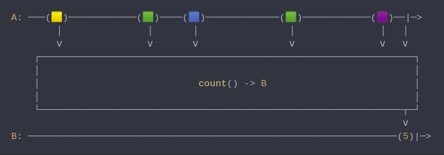

#### [CallbagKit][Callbag] › [Documentation][Documentation] › [Operators][Operators] › [Mathematical][Mathematical]
# Count
> A Callbag [operator][Operators] that will count the number of items emitted by
> the source and emit only this value. And it returns a [single][Sources] source.



<!-- ```swift
A: ───(🟨)────────────(🟩)────(🟦)─────────────(🟩)────────────(🟪)──|─>
        │               │       │                │               │   │
        ⅴ               ⅴ       ⅴ                ⅴ               ⅴ   ⅴ
    ┌──────────────────────────────────────────────────────────────────┐
    │                                                                  │
    │                            count() -> B                          │
    │                                                                  │
    └────────────────────────────────────────────────────────────────┬─┘
                                                                     ⅴ
B: ─────────────────────────────────────────────────────────────────(5)|─>
``` -->

**Examples**

```swift
  let source = from(1...10)

  _ = source
    |> count()
    |> forEach(print) // 10
```

[Callbag]: <../../../README.md> (Callbag)
[Documentation]: <../../README.md> (Documentation)
[Operators]: <../README.md> (Operators)
[Mathematical]: <./README.md> (Mathematical)

[Sources]: <../../Sources/README.md> (Sources)