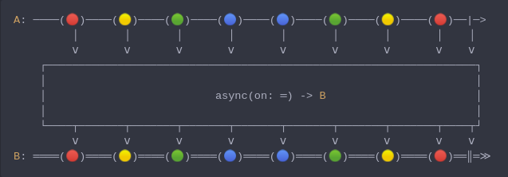

#### [CallbagKit][Callbag] › [Documentation][Documentation] › [Operators][Operators] › [Threading][Threading]
# Async
> A Callbag [operator][Operators] that will specify the `DispatchQueue` on which
> a source will sink this source. And it returns a [listenable][Sources] source.



<!-- ```swift
A: ────(🔴)────(🟡)────(🟢)────(🔵)────(🔵)────(🟢)────(🟡)────(🔴)──|─>
         │       │       │       │       │       │       │       │    │
         ⅴ       ⅴ       ⅴ       ⅴ       ⅴ       ⅴ       ⅴ       ⅴ    ⅴ
    ┌──────────────────────────────────────────────────────────────────┐
    │                                                                  │
    │                          async(on: ═) -> B                       │
    │                                                                  │
    └────┬───────┬───────┬───────┬───────┬───────┬───────┬───────┬────┬┘
         ⅴ       ⅴ       ⅴ       ⅴ       ⅴ       ⅴ       ⅴ       ⅴ    ⅴ
B: ════(🔴)════(🟡)════(🟢)════(🔵)════(🔵)════(🟢)════(🟡)════(🔴)══║═≫
``` -->

**Examples**

```swift
  let source = just(1)

  _ = source
    |> map { _ in print(Thread.isMainThread) } /// true
    |> async(on: .background)
    |> map { _ in print(Thread.isMainThread) } /// false
    |> sink { _ in }
```
> The process of the previous example is visualized as follows:
>```swift
> [                .main             ]  [     .background     ]
> ╭────────╮  ╭─────────╮  ╭─────────╮  ┏━━━━━━━━━┓  ┏━━━━━━━━┓
> │  just  │─>│   map   │─>│  async  │━≻┃   map   ┃━≻┃  sink  ┃
> ╰────────╯  ╰─────────╯  ╰─────────╯  ┗━━━━━━━━━┛  ┗━━━━━━━━┛
>```

```swift
  let source = interval(.nanosecond, on: .main) |> take(1)

  _ = source
    |> map { _ in print(Thread.isMainThread) } /// true on Apple OSes | false on Linux
    |> async(on: .background)
    |> map { _ in print(Thread.isMainThread) } /// false
    |> sink { _ in }
```

[Callbag]: <../../../README.md> (Callbag)
[Documentation]: <../../README.md> (Documentation)
[Operators]: <../README.md> (Operators)
[Threading]: <./README.md> (Threading)

[Sources]: <../../Sources/README.md> (Sources)