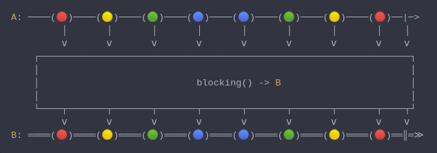

#### [CallbagKit][Callbag] › [Documentation][Documentation] › [Operators][Operators] › [Threading][Threading]
# Blocking
> A Callbag [operator][Operators] that will mirror all emissions and block current
> thread until completion received from source. And it returns a [listenable][Sources] source.



<!-- ```swift
A: ────(🔴)────(🟡)────(🟢)────(🔵)────(🔵)────(🟢)────(🟡)────(🔴)──|─>
         │       │       │       │       │       │       │       │    │
         ⅴ       ⅴ       ⅴ       ⅴ       ⅴ       ⅴ       ⅴ       ⅴ    ⅴ
    ┌──────────────────────────────────────────────────────────────────┐
    │                                                                  │
    │                            blocking() -> B                       │
    │                                                                  │
    └────┬───────┬───────┬───────┬───────┬───────┬───────┬───────┬────┬┘
         ⅴ       ⅴ       ⅴ       ⅴ       ⅴ       ⅴ       ⅴ       ⅴ    ⅴ
B: ════(🔴)════(🟡)════(🟢)════(🔵)════(🔵)════(🟢)════(🟡)════(🔴)══║═≫
``` -->

**Note**
This operator can be used for testing purposes only.

**Examples**

```swift
  let source = interval(.second)

  _ = source
    |> take(2)
    |> blocking() // only use this when not using `DispatchQueue.main`.
    |> forEach(print) // 1
                      // 2
```

```swift
  let source = interval(.nanosecond, on: .main)

  _ = source
    |> take(2)
    |> blockingMain() // this can be used with any type of `DispatchQueue`,
                      // but it will terminate the program after receiving completion.
    |> forEach(print) // 1
                      // 2
```

[Callbag]: <../../../README.md> (Callbag)
[Documentation]: <../../README.md> (Documentation)
[Operators]: <../README.md> (Operators)
[Threading]: <./README.md> (Threading)

[Sources]: <../../Sources/README.md> (Sources)