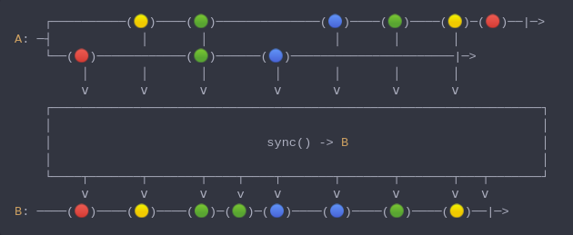

#### [CallbagKit][Callbag] › [Documentation][Documentation] › [Operators][Operators] › [Threading][Threading]
# Sync
> A Callbag [operator][Operators] that will force a source to make synchronized
> calls and to be well-behaved. And it returns a [listenable][Sources] source.



<!-- ```swift
    ┌──────────(🟡)────(🟢)──────────────(🔵)────(🟢)────(🟡)─(🔴)──|─>
A: ─┤            │       │                 │       │       │
    └──(🔴)────────────(🟢)──────(🔵)──────────────────────|─>
         │       │       │         │       │       │       │
         ⅴ       ⅴ       ⅴ         ⅴ       ⅴ       ⅴ       ⅴ
    ┌──────────────────────────────────────────────────────────────────┐
    │                                                                  │
    │                             sync() -> B                          │
    │                                                                  │
    └────┬───────┬───────┬────┬────┬───────┬───────┬───────┬───┬───────┘
         ⅴ       ⅴ       ⅴ    v    ⅴ       ⅴ       ⅴ       ⅴ   ⅴ
B: ────(🔴)────(🟡)────(🟢)─(🟢)─(🔵)────(🔵)────(🟢)────(🟡)──|─>
``` -->

**Note**
> By default factories and operators that its implementation involve with `DispatchQueue`
> like `interval` and `async`, has a locking built-in to prevent concurrent calls and
> make them more serial-like. But assuming if you as developer created your own
> operators and factories that has some concurrent calls with no locking built-in.
> Therefore, this `sync` will helps making things goes smoothly.

**Examples**

Let's say we have created our own concurrent listenable source factory as following:

```swift
  func myConcurrentFactory() -> Producer<Int> {
    return { sink in
      sink(.start({ _ in })) // <- inappropriate way to handle talkback,
                             //    but for the sake of this example it is
                             //    written this way
      let queue = DispatchQueue.concurrent(label: "myConcurrentFactory")
      queue.async {
        for i in 1...9 {
          sink(.next(i))
        }
      }
      queue.async {
        for i in 1...9 {
          sink(.next(i * 100))
        }
      }
      queue.async {
        sink(.completed(.finished))
      }
    }
  }
```

Without `sync` operator:

```swift
  _ = myConcurrentFactory()
    |> sink(print)

    // Prints:
    // next(1)
    // next(100)
    // next(2)
    // next(3)
    // next(200)
    // completed(finished)
    // next(4)
    // next(300)
    // next(5)
    // next(400)
    // next(6)
    // next(500)
    // next(500)
    // next(7)
    // next(7)
```

With `sync` operator:

```swift
  _ = myConcurrentFactory()
    |> sink(print)

    // Prints:
    // next(1)
    // next(2)
    // next(3)
    // next(4)
    // next(5)
    // next(6)
    // next(7)
    // next(8)
    // next(9)
    // next(100)
    // next(200)
    // next(300)
    // next(400)
    // next(500)
    // next(600)
    // next(700)
    // next(800)
    // next(900)
    // completed(finished)
```

[Callbag]: <../../../README.md> (Callbag)
[Documentation]: <../../README.md> (Documentation)
[Operators]: <../README.md> (Operators)
[Threading]: <./README.md> (Threading)

[Sources]: <../../Sources/README.md> (Sources)