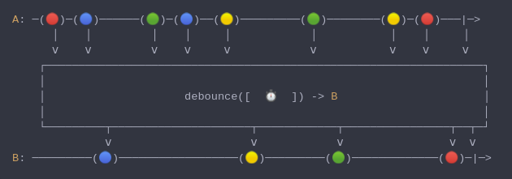

#### [CallbagKit][Callbag] › [Documentation][Documentation] › [Operators][Operators] › [Timing][Timing]
# Debounce
> A Callbag [operator][Operators] that only emit an item from a source if a
> particular timespan has passed without it emitting another item. And it returns
> a [listenable][Sources] source.



<!-- ```swift
A: ─(🔴)─(🔵)──────(🟢)─(🔵)──(🟡)─────────(🟢)────────(🟡)─(🔴)───|─>
      │    │         │    │     │            │           │    │     │
      ⅴ    ⅴ         ⅴ    ⅴ     ⅴ            ⅴ           ⅴ    ⅴ     ⅴ
    ┌──────────────────────────────────────────────────────────────────┐
    │                                                                  │
    │                     debounce([  ⏱️  ]) -> B                      │
    │                                                                  │
    └─────────┬─────────────────────┬────────────┬────────────────┬──┬─┘
              ⅴ                     ⅴ            ⅴ                ⅴ  ⅴ
B: ─────────(🔵)──────────────────(🟡)─────────(🟢)─────────────(🔴)─|─>
``` -->

**Examples**

```swift
  let bounces:[(Int,Double)] = [
    (0, 0),
    (1, 0.25),  // 0.25s interval since last index
    (2, 1),     // 0.75s interval since last index
    (3, 1.25),  // 0.25s interval since last index
    (4, 1.5),   // 0.25s interval since last index
    (5, 2)      // 0.5s interval since last index
  ]

  let source = from(bounces)

  _ = source
    |> flatMap { (value, interval) in
        return just(value)
          |> delay(.seconds(interval))
    }
    |> debounce(.seconds(0.5))
    |> forEach(print) // 1
                      // 4
                      // 5
```

[Callbag]: <../../../README.md> (Callbag)
[Documentation]: <../../README.md> (Documentation)
[Operators]: <../README.md> (Operators)
[Timing]: <./README.md> (Timing)

[Sources]: <../../Sources/README.md> (Sources)