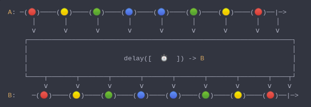

#### [CallbagKit][Callbag] › [Documentation][Documentation] › [Operators][Operators] › [Timing][Timing]
# Delay
> A Callbag [operator][Operators] that shift the emissions from a source forward
> in time by a particular amount. And it returns a [listenable][Sources] source.



<!-- ```swift
A: ─(🔴)────(🟡)────(🟢)────(🔵)────(🔵)────(🟢)────(🟡)────(🔴)──|─>
      │       │       │       │       │       │       │       │    │
      ⅴ       ⅴ       ⅴ       ⅴ       ⅴ       ⅴ       ⅴ       ⅴ    ⅴ
    ┌──────────────────────────────────────────────────────────────────┐
    │                                                                  │
    │                        delay([  ⏱️  ]) -> B                      │
    │                                                                  │
    └────┬───────┬───────┬───────┬───────┬───────┬───────┬───────┬────┬┘
         ⅴ       ⅴ       ⅴ       ⅴ       ⅴ       ⅴ       ⅴ       ⅴ    ⅴ
B:    ─(🔴)────(🟡)────(🟢)────(🔵)────(🔵)────(🟢)────(🟡)────(🔴)──|─>
``` -->

**Examples**

```swift
_ = from(1...3)
  |> delay(.second)
  |> sink(print) // 1 after .second
                 // 2
                 // 3
```

[Callbag]: <../../../README.md> (Callbag)
[Documentation]: <../../README.md> (Documentation)
[Operators]: <../README.md> (Operators)
[Timing]: <./README.md> (Timing)

[Sources]: <../../Sources/README.md> (Sources)