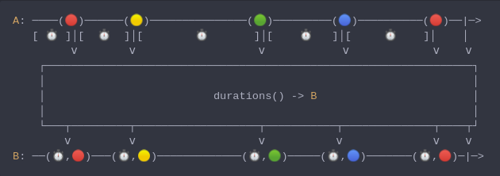

#### [CallbagKit][Callbag] › [Documentation][Documentation] › [Operators][Operators] › [Timing][Timing]
# Durations
> A Callbag [operator][Operators] that will emit the `TimeInterval` since the previous
> emission along with the emitted value. And it returns a [pullable][Sources] /
> [listenable][Sources] source, depends on the given callbag sources types.



<!-- ```swift
A: ────(🔴)──────(🟡)───────────────(🟢)─────────(🔵)──────────(🔴)──|─>
   [ ⏱️ ]│[  ⏱️  ]│[        ⏱️       ]│[    ⏱️   ]│[     ⏱️    ]│    │
         ⅴ        ⅴ                   ⅴ            ⅴ             ⅴ    ⅴ
    ┌──────────────────────────────────────────────────────────────────┐
    │                                                                  │
    │                          durations() -> B                        │
    │                                                                  │
    └───┬─────────┬───────────────────┬───────────┬──────────────┬────┬┘
        ⅴ         ⅴ                   ⅴ           ⅴ              ⅴ    ⅴ
B: ──(⏱️,🔴)───(⏱️,🟡)─────────────(⏱️,🟢)─────(⏱️,🔵)───────(⏱️,🔴)─|─>
``` -->

**Examples**

```swift
_ = interval(.second)
  |> take(5)
  |> durations()
  |> forEach(print) // (1.0003719329833984, 0)
                    // (1.0012321472167969, 1)
                    // (1.0001850128173828, 2)
                    // (1.0002129077911377, 3)
                    // (1.0002059936523438, 4)
```

[Callbag]: <../../../README.md> (Callbag)
[Documentation]: <../../README.md> (Documentation)
[Operators]: <../README.md> (Operators)
[Timing]: <./README.md> (Timing)

[Sources]: <../../Sources/README.md> (Sources)