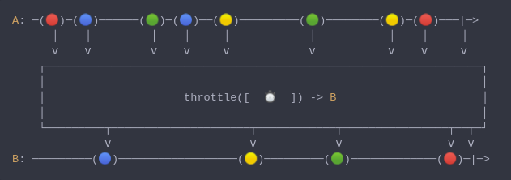

#### [CallbagKit][Callbag] › [Documentation][Documentation] › [Operators][Operators] › [Timing][Timing]
# Throttle
> A Callbag [operator][Operators] that emits either the first/last item emitted by
> the source during sequential time windows of a specified duration based on the
> given `ThrottleStrategy` default is `.latest`. And it returns a [listenable][Sources] source.



<!-- ```swift
A: ─(🔴)─(🔵)──────(🟢)─(🔵)──(🟡)─────────(🟢)────────(🟡)─(🔴)───|─>
      │    │         │    │     │            │           │    │     │
      ⅴ    ⅴ         ⅴ    ⅴ     ⅴ            ⅴ           ⅴ    ⅴ     ⅴ
    ┌──────────────────────────────────────────────────────────────────┐
    │                                                                  │
    │                     throttle([  ⏱️  ]) -> B                      │
    │                                                                  │
    └─────────┬─────────────────────┬────────────┬────────────────┬──┬─┘
              ⅴ                     ⅴ            ⅴ                ⅴ  ⅴ
B: ─────────(🔵)──────────────────(🟡)─────────(🟢)─────────────(🔴)─|─>
``` -->

**Examples**

```swift
  let source = interval(.seconds(3))

  _ = source
    |> debug(Date().description)
    |> throttle(.seconds(10), strategy: .latest)
    |> take(5)
    |> forEach(print)

  // Prints:
  //
  // 2020-10-07 12:03:12 +0000: ≺─ request start((Callbag<Int, Optional<Any>>) -> Void)
  // 2020-10-07 12:03:12 +0000: ─≻ receive start((Callbag<Optional<Any>, Int>) -> Void)
  // 2020-10-07 12:03:12 +0000: ≺─ request next(nil)
  // 2020-10-07 12:03:15 +0000: ─≻ receive next(0)
  // 2020-10-07 12:03:15 +0000: ≺─ request next(nil)
  // 2020-10-07 12:03:18 +0000: ─≻ receive next(1)
  // 2020-10-07 12:03:18 +0000: ≺─ request next(nil)
  // 2020-10-07 12:03:21 +0000: ─≻ receive next(2)
  // 2020-10-07 12:03:21 +0000: ≺─ request next(nil)
  // 2
  // 2020-10-07 12:03:24 +0000: ─≻ receive next(3)
  // 2020-10-07 12:03:24 +0000: ≺─ request next(nil)
  // 2020-10-07 12:03:27 +0000: ─≻ receive next(4)
  // 2020-10-07 12:03:27 +0000: ≺─ request next(nil)
  // 2020-10-07 12:03:30 +0000: ─≻ receive next(5)
  // 2020-10-07 12:03:30 +0000: ≺─ request next(nil)
  // 5
  // 2020-10-07 12:03:33 +0000: ─≻ receive next(6)
  // 2020-10-07 12:03:33 +0000: ≺─ request next(nil)
  // 2020-10-07 12:03:36 +0000: ─≻ receive next(7)
  // 2020-10-07 12:03:36 +0000: ≺─ request next(nil)
  // 2020-10-07 12:03:39 +0000: ─≻ receive next(8)
  // 2020-10-07 12:03:39 +0000: ≺─ request next(nil)
  // 8
  // 2020-10-07 12:03:42 +0000: ─≻ receive next(9)
  // 2020-10-07 12:03:42 +0000: ≺─ request next(nil)
  // 2020-10-07 12:03:45 +0000: ─≻ receive next(10)
  // 2020-10-07 12:03:45 +0000: ≺─ request next(nil)
  // 2020-10-07 12:03:48 +0000: ─≻ receive next(11)
  // 2020-10-07 12:03:48 +0000: ≺─ request next(nil)
  // 2020-10-07 12:03:51 +0000: ─≻ receive next(12)
  // 2020-10-07 12:03:51 +0000: ≺─ request next(nil)
  // 12
  // 2020-10-07 12:03:54 +0000: ─≻ receive next(13)
  // 2020-10-07 12:03:54 +0000: ≺─ request next(nil)
  // 2020-10-07 12:03:57 +0000: ─≻ receive next(14)
  // 2020-10-07 12:03:57 +0000: ≺─ request next(nil)
  // 2020-10-07 12:04:00 +0000: ─≻ receive next(15)
  // 2020-10-07 12:04:00 +0000: ≺─ request next(nil)
  // 15
  // 2020-10-07 12:04:03 +0000: ─≻ receive next(16)
  // 2020-10-07 12:04:03 +0000: ≺─ request next(nil)
  // 2020-10-07 12:04:06 +0000: ─≻ receive next(17)
  // 2020-10-07 12:04:06 +0000: ≺─ request next(nil)
  // 2020-10-07 12:04:09 +0000: ─≻ receive next(18)
  // 2020-10-07 12:04:09 +0000: ≺─ request next(nil)
  // 2020-10-07 12:04:12 +0000: ─≻ receive next(19)
  // 2020-10-07 12:04:12 +0000: ≺─ request completed(finished)
  // 2020-10-07 12:04:15 +0000: ─≻ receive completed(finished)
```

[Callbag]: <../../../README.md> (Callbag)
[Documentation]: <../../README.md> (Documentation)
[Operators]: <../README.md> (Operators)
[Timing]: <./README.md> (Timing)

[Sources]: <../../Sources/README.md> (Sources)