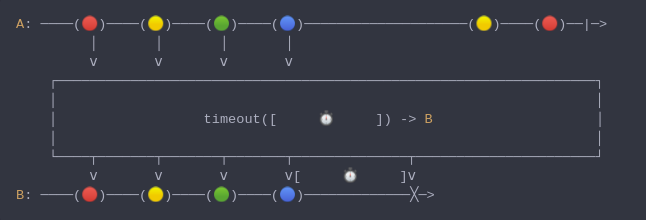

#### [CallbagKit][Callbag] › [Documentation][Documentation] › [Operators][Operators] › [Timing][Timing]
# Timeout
> A Callbag [operator][Operators] that mirror the source, but issue an error if a
> particular period of time elapses without any emitted items. And it returns a
> [listenable][Sources] source.



<!-- ```swift
A: ────(🔴)────(🟡)────(🟢)────(🔵)────────────────────(🟡)────(🔴)──|─>
         │       │       │       │
         ⅴ       ⅴ       ⅴ       ⅴ
    ┌──────────────────────────────────────────────────────────────────┐
    │                                                                  │
    │                  timeout([     ⏱️     ]) -> B                    │
    │                                                                  │
    └────┬───────┬───────┬───────┬──────────────┬──────────────────────┘
         ⅴ       ⅴ       ⅴ       ⅴ[     ⏱️     ]ⅴ
B: ────(🔴)────(🟡)────(🟢)────(🔵)─────────────╳─>
``` -->

**Examples**

```swift
  let intervals:[(Int,Double)] = [
    (0, 0),
    (1, 0.25),  // 0.25s interval since last index
    (2, 1),     // 0.75s interval since last index
    (3, 1.25),  // 0.25s interval since last index
    (4, 1.5),   // 0.25s interval since last index
    (5, 2)      // 0.5s interval since last index
  ]

  let source = from(intervals)

  _ = source
    |> flatMap { (value, interval) in
        return just(value)
          |> delay(.seconds(interval))
    }
    |> timeout(.seconds(0.5))
    |> sink(print) // next(0)
                   // next(1)
                   // completed(finished)
```

```swift
  struct TimeoutError: Error {}

  let intervals:[(Int,Double)] = [
    (0, 0),
    (1, 0.25),  // 0.25s interval since last index
    (2, 1),     // 0.75s interval since last index
    (3, 1.25),  // 0.25s interval since last index
    (4, 1.5),   // 0.25s interval since last index
    (5, 2)      // 0.5s interval since last index
  ]

  let source = from(intervals)

  _ = source
    |> flatMap { (value, interval) in
        return just(value)
          |> delay(.seconds(interval))
    }
    |> timeout(.seconds(0.5), customError: TimeoutError())
    |> sink(print) // next(0)
                   // next(1)
                   // completed(failed(TimeoutError()))
```

[Callbag]: <../../../README.md> (Callbag)
[Documentation]: <../../README.md> (Documentation)
[Operators]: <../README.md> (Operators)
[Timing]: <./README.md> (Timing)

[Sources]: <../../Sources/README.md> (Sources)