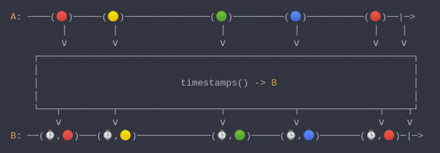

#### [CallbagKit][Callbag] › [Documentation][Documentation] › [Operators][Operators] › [Timing][Timing]
# Timestamps
> A Callbag [operator][Operators] that will emit the `TimeIntervalSince1970` along
> with the emitted value. And it returns a [pullable][Sources] / [listenable][Sources]
> source, depends on the given callbag sources types.



<!-- ```swift
A: ────(🔴)─────(🟡)───────────────(🟢)─────────(🔵)──────────(🔴)──|─>
         │        │                  │            │             │    │
         ⅴ        ⅴ                  ⅴ            ⅴ             ⅴ    ⅴ
    ┌──────────────────────────────────────────────────────────────────┐
    │                                                                  │
    │                         timestamps() -> B                        │
    │                                                                  │
    └───┬─────────┬──────────────────┬────────────┬──────────────┬────┬┘
        ⅴ         ⅴ                  ⅴ            ⅴ              ⅴ    ⅴ
B: ──(⌚,🔴)───(⌚,🟡)─────────────(⌚,🟢)─────(⌚,🔵)───────(⌚,🔴)─|─>
``` -->

**Examples**

```swift
_ = interval(.second)
  |> take(5)
  |> timestamps()
  |> forEach(print) // (1602129221.323708, 0)
                    // (1602129222.324597, 1)
                    // (1602129223.324815, 2)
                    // (1602129224.325068, 3)
                    // (1602129225.325264, 4)
```

[Callbag]: <../../../README.md> (Callbag)
[Documentation]: <../../README.md> (Documentation)
[Operators]: <../README.md> (Operators)
[Timing]: <./README.md> (Timing)

[Sources]: <../../Sources/README.md> (Sources)