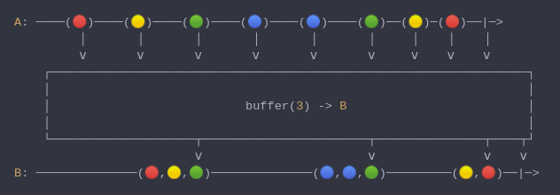

#### [CallbagKit][Callbag] › [Documentation][Documentation] › [Operators][Operators] › [Transforming][Transforming]
# Buffer
> A Callbag [operator][Operators] that periodically gather items emitted by a source 
> into bundles and emit these bundles rather than emitting the items one at a time.
> And it returns a [listenable][Sources] source.



<!-- ```swift
A: ────(🔴)────(🟡)────(🟢)────(🔵)────(🔵)────(🟢)──(🟡)─(🔴)──|─>
         │       │       │       │       │       │     │    │    │
         ⅴ       ⅴ       ⅴ       ⅴ       ⅴ       ⅴ     ⅴ    ⅴ    ⅴ
    ┌──────────────────────────────────────────────────────────────────┐
    │                                                                  │
    │                           buffer(3) -> B                         │
    │                                                                  │
    └────────────────────┬───────────────────────┬───────────────┬────┬┘
                         ⅴ                       ⅴ               ⅴ    ⅴ
B: ──────────────(🔴,🟡,🟢)──────────────(🔵,🔵,🟢)─────────(🟡,🔴)──|─>
``` -->

**Examples**

```swift
  _ = from(1...8)
    |> buffer(3)
    |> forEach(print) // [1, 2, 3]
                      // [4, 5, 6]
                      // [7, 8]
```

```swift
  _ = interval(.seconds(0.3))
    |> take(8)
    |> buffer(.second)
    |> forEach(print) // [1, 2, 3]
                      // [4, 5, 6]
                      // [7, 8]
```

```swift
  _ = interval(.seconds(0.3))
    |> buffer(interval(.second))
    |> take(3)
    |> forEach(print) // [1, 2, 3]
                      // [4, 5, 6]
                      // [7, 8, 9]
```

[Callbag]: <../../../README.md> (Callbag)
[Documentation]: <../../README.md> (Documentation)
[Operators]: <../README.md> (Operators)
[Transforming]: <./README.md> (Transforming)

[Sources]: <../../Sources/README.md> (Sources)