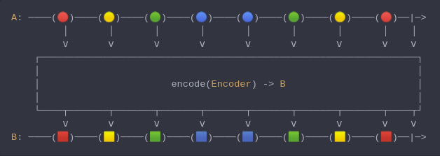
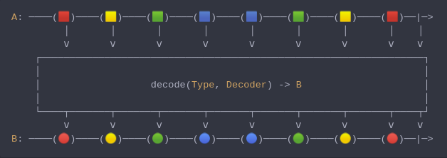

#### [CallbagKit][Callbag] › [Documentation][Documentation] › [Operators][Operators] › [Transforming][Transforming]
# Codable
> A Callbag [operator][Operators] that will `encode` / `decode` data to a certain `Encodable`
> / `Decodable` type. And it returns a [pullable][Sources] / [listenable][Sources] source,
> depends on the given callbag sources types.



<!-- ```swift
A: ────(🔴)────(🟡)────(🟢)────(🔵)────(🔵)────(🟢)────(🟡)────(🔴)──|─>
         │       │       │       │       │       │       │       │    │
         ⅴ       ⅴ       ⅴ       ⅴ       ⅴ       ⅴ       ⅴ       ⅴ    ⅴ
    ┌──────────────────────────────────────────────────────────────────┐
    │                                                                  │
    │                       encode(Encoder) -> B                       │
    │                                                                  │
    └────┬───────┬───────┬───────┬───────┬───────┬───────┬───────┬────┬┘
         ⅴ       ⅴ       ⅴ       ⅴ       ⅴ       ⅴ       ⅴ       ⅴ    ⅴ
B: ────(🟥)────(🟨)────(🟩)────(🟦)────(🟦)────(🟩)────(🟨)────(🟥)──|─>
``` -->



<!-- ```swift
A: ────(🟥)────(🟨)────(🟩)────(🟦)────(🟦)────(🟩)────(🟨)────(🟥)──|─>
         │       │       │       │       │       │       │       │    │
         ⅴ       ⅴ       ⅴ       ⅴ       ⅴ       ⅴ       ⅴ       ⅴ    ⅴ
    ┌──────────────────────────────────────────────────────────────────┐
    │                                                                  │
    │                   decode(Type, Decoder) -> B                     │
    │                                                                  │
    └────┬───────┬───────┬───────┬───────┬───────┬───────┬───────┬────┬┘
         ⅴ       ⅴ       ⅴ       ⅴ       ⅴ       ⅴ       ⅴ       ⅴ    ⅴ
B: ────(🔴)────(🟡)────(🟢)────(🔵)────(🔵)────(🟢)────(🟡)────(🔴)──|─>
``` -->

**Examples**

```swift
  import class Foundation.JSONEncoder

  _ = of(["hello": "world!"])
    |> encode(encoder: JSONEncoder())
    |> compact { String(data: $0, encoding: .utf8) }
    |> forEach(print) // "{\"hello\":\"world!\"}"
```

```swift
  import struct Foundation.Data
  import class Foundation.JSONDecoder

  _ = of(Data("{\"hello\":\"world!\"}".utf8))
    |> decode(type: Dictionary<String, String>.self, decoder: JSONDecoder())
    |> forEach(print) // ["hello": "world!"]
```

[Callbag]: <../../../README.md> (Callbag)
[Documentation]: <../../README.md> (Documentation)
[Operators]: <../README.md> (Operators)
[Transforming]: <./README.md> (Transforming)

[Sources]: <../../Sources/README.md> (Sources)