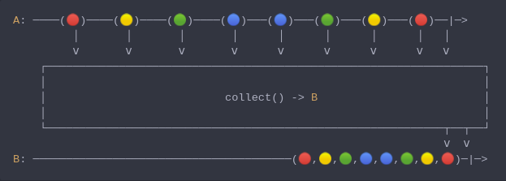
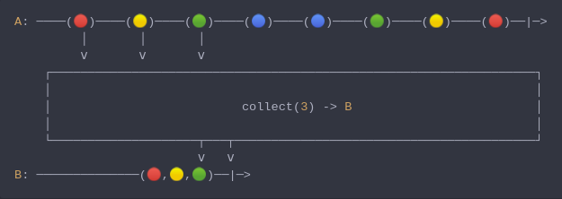

#### [CallbagKit][Callbag] › [Documentation][Documentation] › [Operators][Operators] › [Transforming][Transforming]
# Collect
> A Callbag [operator][Operators] that gather items upto certain count and emit
> this as a array. And it returns a [single][Sources] source.



<!-- ```swift
A: ────(🔴)────(🟡)────(🟢)────(🔵)───(🔵)───(🟢)───(🟡)───(🔴)──|─>
         │       │       │       │      │      │      │      │   │
         ⅴ       ⅴ       ⅴ       ⅴ      ⅴ      ⅴ      ⅴ      ⅴ   ⅴ
    ┌──────────────────────────────────────────────────────────────────┐
    │                                                                  │
    │                           collect() -> B                         │
    │                                                                  │
    └────────────────────────────────────────────────────────────┬──┬──┘
                                                                 ⅴ  ⅴ
B: ───────────────────────────────────────(🔴,🟡,🟢,🔵,🔵,🟢,🟡,🔴)─|─>
``` -->



<!-- ```swift
A: ────(🔴)────(🟡)────(🟢)────(🔵)────(🔵)────(🟢)────(🟡)────(🔴)──|─>
         │       │       │
         ⅴ       ⅴ       ⅴ
    ┌──────────────────────────────────────────────────────────────────┐
    │                                                                  │
    │                          collect(3) -> B                         │
    │                                                                  │
    └────────────────────┬───┬─────────────────────────────────────────┘
                         ⅴ   ⅴ
B: ──────────────(🔴,🟡,🟢)──|─>
``` -->

**Examples**

```swift
  _ = from(1...8)
    |> collect(3)
    |> forEach(print) // [1, 2, 3]
```

```swift
  _ = interval(.seconds(0.3))
    |> take(8)
    |> collect()
    |> forEach(print) // [1, 2, 3, 4, 5, 6, 7, 8]
```

[Callbag]: <../../../README.md> (Callbag)
[Documentation]: <../../README.md> (Documentation)
[Operators]: <../README.md> (Operators)
[Transforming]: <./README.md> (Transforming)

[Sources]: <../../Sources/README.md> (Sources)