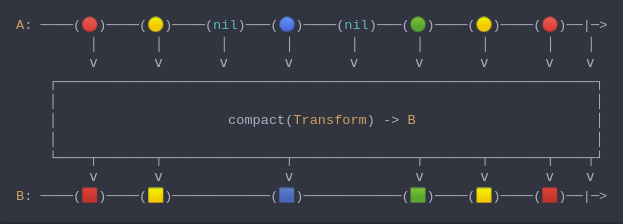
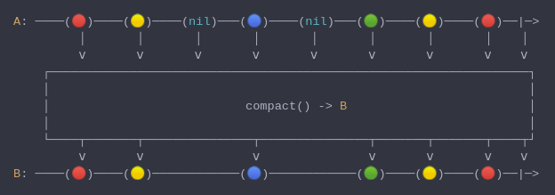

#### [CallbagKit][Callbag] › [Documentation][Documentation] › [Operators][Operators] › [Transforming][Transforming]
# Compact
> A Callbag [operator][Operators] that will discard `nil` and only allow `non-nil`
> items to be sinked. And it returns a [pullable][Sources] / [listenable][Sources]
> source, depends on the given callbag sources types.



<!-- ```swift
A: ────(🔴)────(🟡)────(nil)───(🔵)────(nil)───(🟢)────(🟡)────(🔴)──|─>
         │       │       │       │       │       │       │       │    │
         ⅴ       ⅴ       ⅴ       ⅴ       ⅴ       ⅴ       ⅴ       ⅴ    ⅴ
    ┌──────────────────────────────────────────────────────────────────┐
    │                                                                  │
    │                     compact(Transform) -> B                      │
    │                                                                  │
    └────┬───────┬───────────────┬───────────────┬───────┬───────┬────┬┘
         ⅴ       ⅴ               ⅴ               ⅴ       ⅴ       ⅴ    ⅴ
B: ────(🟥)────(🟨)────────────(🟦)────────────(🟩)────(🟨)────(🟥)──|─>
``` -->



<!-- ```swift
A: ────(🔴)────(🟡)────(nil)───(🔵)────(nil)───(🟢)────(🟡)────(🔴)──|─>
         │       │       │       │       │       │       │       │    │
         ⅴ       ⅴ       ⅴ       ⅴ       ⅴ       ⅴ       ⅴ       ⅴ    ⅴ
    ┌──────────────────────────────────────────────────────────────────┐
    │                                                                  │
    │                           compact() -> B                         │
    │                                                                  │
    └────┬───────┬───────────────┬───────────────┬───────┬───────┬────┬┘
         ⅴ       ⅴ               ⅴ               ⅴ       ⅴ       ⅴ    ⅴ
B: ────(🔴)────(🟡)────────────(🔵)────────────(🟢)────(🟡)────(🔴)──|─>
``` -->

**Examples**

```swift
  _ = of(1, 2, 3, nil, 4, 5, nil)
    |> compact { $0 != nil ? String($0) : nil }
    |> forEach(print) // "1"
                      // "2"
                      // "3"
                      // "4"
                      // "5"
```

```swift
  _ = of(1, 2, 3, nil, 4, 5, nil)
    |> compact()
    |> forEach(print) // 1
                      // 2
                      // 3
                      // 4
                      // 5
```

[Callbag]: <../../../README.md> (Callbag)
[Documentation]: <../../README.md> (Documentation)
[Operators]: <../README.md> (Operators)
[Transforming]: <./README.md> (Transforming)

[Sources]: <../../Sources/README.md> (Sources)