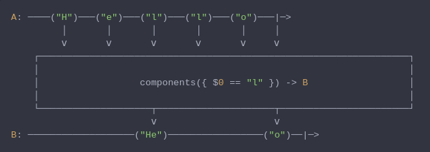

#### [CallbagKit][Callbag] › [Documentation][Documentation] › [Operators][Operators] › [Transforming][Transforming]
# Components
> A Callbag [operator][Operators] that will splits the emitted characters by a
> separator and emit these splitted characters as string. And it returns a
> [listenable][Sources] source.



<!-- ```swift
A: ────("H")───("e")───("l")───("l")───("o")───|─>
         │       │       │       │       │     │
         ⅴ       ⅴ       ⅴ       ⅴ       ⅴ     ⅴ
    ┌──────────────────────────────────────────────────────────────────┐
    │                                                                  │
    │                  components({ $0 == "l" }) -> B                  │
    │                                                                  │
    └────────────────────┬─────────────────────┬───────────────────────┘
                         ⅴ                     ⅴ
B: ───────────────────("He")─────────────────("o")──|─>
``` -->

**Examples**

```swift
  _ = from(", 1, 2, 3, 4, 5, ")
    |> components({ ", ".contains($0) })
    |> forEach(print) // "1"
                      // "2"
                      // "3"
                      // "4"
                      // "5"
```

```swift
  _ = from(", 12, 34, 5, ")
    |> components(", ")
    |> forEach(print) // "12"
                      // "34"
                      // "5"
```

[Callbag]: <../../../README.md> (Callbag)
[Documentation]: <../../README.md> (Documentation)
[Operators]: <../README.md> (Operators)
[Transforming]: <./README.md> (Transforming)

[Sources]: <../../Sources/README.md> (Sources)