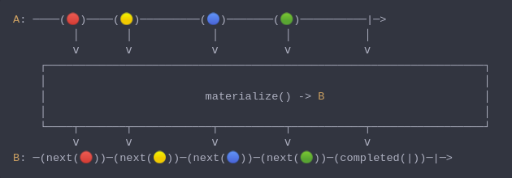
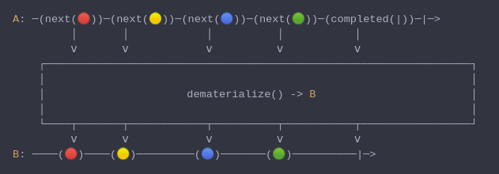

#### [CallbagKit][Callbag] › [Documentation][Documentation] › [Operators][Operators] › [Transforming][Transforming]
# Materialize / Dematerialize
> A Callbag [operator][Operators] that will represent both the items emitted and
> the completion sent as emitted items, or reverse this process. And it returns a
> [pullable][Sources] / [listenable][Sources] source, depends on the given callbag
> sources types.



<!-- ```swift
A: ────(🔴)────(🟡)─────────(🔵)───────(🟢)──────────|─>
         │       │            │          │           │
         ⅴ       ⅴ            ⅴ          ⅴ           ⅴ
    ┌──────────────────────────────────────────────────────────────────┐
    │                                                                  │
    │                        materialize() -> B                        │
    │                                                                  │
    └────┬───────┬────────────┬──────────┬───────────┬─────────────────┘
         ⅴ       ⅴ            ⅴ          ⅴ           ⅴ
B: ─(next(🔴))─(next(🟡))─(next(🔵))─(next(🟢))─(completed(|))─|─>
``` -->



<!-- ```swift
A: ─(next(🔴))─(next(🟡))─(next(🔵))─(next(🟢))─(completed(|))─|─>
         │       │            │          │           │
         ⅴ       ⅴ            ⅴ          ⅴ           ⅴ
    ┌──────────────────────────────────────────────────────────────────┐
    │                                                                  │
    │                      dematerialize() -> B                        │
    │                                                                  │
    └────┬───────┬────────────┬──────────┬───────────┬─────────────────┘
         ⅴ       ⅴ            ⅴ          ⅴ           ⅴ
B: ────(🔴)────(🟡)─────────(🔵)───────(🟢)──────────|─>
``` -->

**Examples**

```swift
  _ = of(1, 2, 3, 4, 5)
    |> materialize()
    |> forEach(print) // next(1)
                      // next(2)
                      // next(3)
                      // next(4)
                      // next(5)
                      // completed(.finished)
```

```swift
  let materialized = (1...5).map {
    Sink<Int>.next($0)
  } + [ Sink<Int>.completed(.finished) ]

  _ = from(materialized)
    |> dematerialize()
    |> forEach(print) // 1
                      // 2
                      // 3
                      // 4
                      // 5
```

[Callbag]: <../../../README.md> (Callbag)
[Documentation]: <../../README.md> (Documentation)
[Operators]: <../README.md> (Operators)
[Transforming]: <./README.md> (Transforming)

[Sources]: <../../Sources/README.md> (Sources)