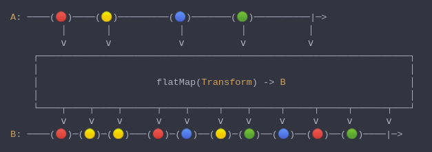

#### [CallbagKit][Callbag] › [Documentation][Documentation] › [Operators][Operators] › [Transforming][Transforming]
# FlatMap
> A Callbag [operator][Operators] that will transform the items emitted by a source
> into sources, then flatten the emissions from those into a single source. And it
> returns a [listenable][Sources] source.



<!-- ```swift
A: ────(🔴)────(🟡)─────────(🔵)───────(🟢)──────────|─>
         │       │            │          │           │
         ⅴ       ⅴ            ⅴ          ⅴ           ⅴ
    ┌──────────────────────────────────────────────────────────────────┐
    │                                                                  │
    │                     flatMap(Transform) -> B                      │
    │                                                                  │
    └────┬────┬────┬──────┬────┬─────┬────┬─────┬─────┬─────┬──────┬───┘
         ⅴ    ⅴ    ⅴ      ⅴ    ⅴ     ⅴ    ⅴ     ⅴ     ⅴ     ⅴ      ⅴ
B: ────(🔴)─(🟡)─(🟡)───(🔴)─(🔵)──(🟡)─(🟢)──(🔵)──(🔴)──(🟢)────|─>
``` -->

**Examples**

```swift
  _ = of(1, 2)
    |> flatMap { _ in of(1, 2) }
    |> forEach(print) // 1
                      // 2
                      // 1
                      // 2
```

[Callbag]: <../../../README.md> (Callbag)
[Documentation]: <../../README.md> (Documentation)
[Operators]: <../README.md> (Operators)
[Transforming]: <./README.md> (Transforming)

[Sources]: <../../Sources/README.md> (Sources)