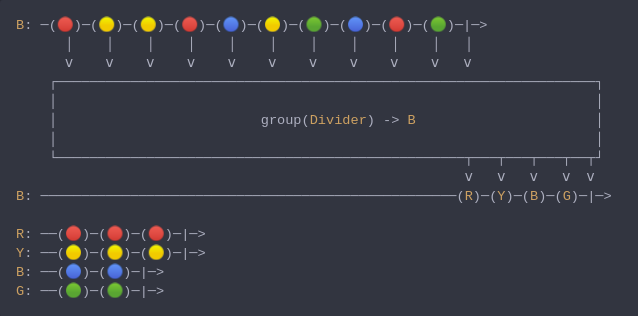

#### [CallbagKit][Callbag] › [Documentation][Documentation] › [Operators][Operators] › [Transforming][Transforming]
# Group
> A Callbag [operator][Operators] that will divide a source into a set of sources
> that each emit a different subset of items from the original source. And it returns
> a [pullable][Sources] / [listenable][Sources] source, depends on the given callbag
> sources types.



<!-- ```swift
B: ─(🔴)─(🟡)─(🟡)─(🔴)─(🔵)─(🟡)─(🟢)─(🔵)─(🔴)─(🟢)─|─>
      │    │    │    │    │    │    │    │    │    │   │
      ⅴ    ⅴ    ⅴ    ⅴ    ⅴ    ⅴ    ⅴ    ⅴ    ⅴ    ⅴ   ⅴ
    ┌──────────────────────────────────────────────────────────────────┐
    │                                                                  │
    │                         group(Divider) -> B                      │
    │                                                                  │
    └──────────────────────────────────────────────────┬───┬───┬───┬──┬┘
                                                       ⅴ   ⅴ   ⅴ   ⅴ  ⅴ
B: ───────────────────────────────────────────────────(R)─(Y)─(B)─(G)─|─>

R: ──(🔴)─(🔴)─(🔴)─|─>
Y: ──(🟡)─(🟡)─(🟡)─|─>
B: ──(🔵)─(🔵)─|─>
G: ──(🟢)─(🟢)─|─>
``` -->

**Examples**

```swift
  _ = from(1...10)
    |> group { $0 % 2 == 0 }
    |> forEach { (key, source) in
      _ = source
        |> sink { value in
          print("group[\(key)] = \(value)")
        }
    } // group[false] = next(1)
      // group[false] = next(3)
      // group[false] = next(5)
      // group[false] = next(7)
      // group[false] = next(9)
      // group[false] = completed(finished)
      // group[true] = next(2)
      // group[true] = next(4)
      // group[true] = next(6)
      // group[true] = next(8)
      // group[true] = next(10)
      // group[true] = completed(finished)
```

```swift
  _ = from(1...10)
    |> group { (int) -> String in
      switch int {
      case 1...3:
        return "1...3"
      case 4...6:
        return "4...6"
      case 7...9:
        return "7...9"
      default:
        return "10"
      }
    }
    |> forEach { (key, source) in
      _ = source
        |> sink { value in
          print("range(\(key)) = \(value)")
        }
    } // range(1...3) = next(1)
      // range(1...3) = next(2)
      // range(1...3) = next(3)
      // range(1...3) = completed(finished)
      // range(4...6) = next(4)
      // range(4...6) = next(5)
      // range(4...6) = next(6)
      // range(4...6) = completed(finished)
      // range(7...9) = next(7)
      // range(7...9) = next(8)
      // range(7...9) = next(9)
      // range(7...9) = completed(finished)
      // range(10) = next(10)
      // range(10) = completed(finished)
```

[Callbag]: <../../../README.md> (Callbag)
[Documentation]: <../../README.md> (Documentation)
[Operators]: <../README.md> (Operators)
[Transforming]: <./README.md> (Transforming)

[Sources]: <../../Sources/README.md> (Sources)