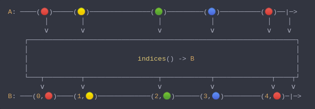

#### [CallbagKit][Callbag] › [Documentation][Documentation] › [Operators][Operators] › [Transforming][Transforming]
# Indices
> A Callbag [operator][Operators] that will emit the current `Index` of an item
> along with the emitted item. And it returns a [pullable][Sources] / [listenable][Sources]
> source, depends on the given callbag sources types.



<!-- ```swift
A: ────(🔴)─────(🟡)───────────────(🟢)─────────(🔵)──────────(🔴)──|─>
         │        │                  │            │             │    │
         ⅴ        ⅴ                  ⅴ            ⅴ             ⅴ    ⅴ
    ┌──────────────────────────────────────────────────────────────────┐
    │                                                                  │
    │                           indices() -> B                         │
    │                                                                  │
    └───┬─────────┬──────────────────┬────────────┬──────────────┬────┬┘
        ⅴ         ⅴ                  ⅴ            ⅴ              ⅴ    ⅴ
B: ───(0,🔴)────(1,🟡)─────────────(2,🟢)──────(3,🔵)─────────(4,🔴)─|─>
``` -->

**Examples**

```swift
  _ = from(1...5)
    |> indices()
    |> forEach(print) // (0, 1)
                      // (1, 2)
                      // (2, 3)
                      // (3, 4)
                      // (4, 5)
```

[Callbag]: <../../../README.md> (Callbag)
[Documentation]: <../../README.md> (Documentation)
[Operators]: <../README.md> (Operators)
[Transforming]: <./README.md> (Transforming)

[Sources]: <../../Sources/README.md> (Sources)