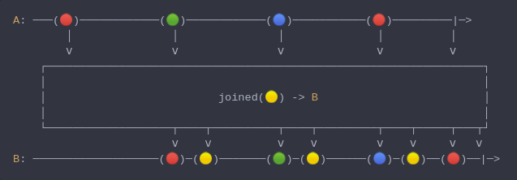

#### [CallbagKit][Callbag] › [Documentation][Documentation] › [Operators][Operators] › [Transforming][Transforming]
# Joined
> A Callbag [operator][Operators] that will emit a given item between emitted items
> from source. And it returns a [listenable][Sources] source.



<!-- ```swift
A: ───(🔴)────────────(🟢)────────────(🔵)───────────(🔴)─────────|─>
        │               │               │              │          │
        ⅴ               ⅴ               ⅴ              ⅴ          ⅴ
    ┌──────────────────────────────────────────────────────────────────┐
    │                                                                  │
    │                          joined(🟡) -> B                         │
    │                                                                  │
    └───────────────────┬────┬──────────┬────┬─────────┬────┬─────┬───┬┘
                        ⅴ    ⅴ          ⅴ    ⅴ         ⅴ    ⅴ     ⅴ   ⅴ
B: ───────────────────(🔴)─(🟡)───────(🟢)─(🟡)──────(🔵)─(🟡)──(🔴)──|─>
``` -->

**Examples**

```swift
  _ = of(1, 2)
    |> joined(0)
    |> forEach(print) // 1
                      // 0
                      // 2
```

```swift
  _ = of(1)
    |> joined(0)
    |> forEach(print) // 1
```

[Callbag]: <../../../README.md> (Callbag)
[Documentation]: <../../README.md> (Documentation)
[Operators]: <../README.md> (Operators)
[Transforming]: <./README.md> (Transforming)

[Sources]: <../../Sources/README.md> (Sources)