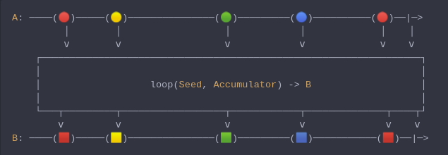

#### [CallbagKit][Callbag] › [Documentation][Documentation] › [Operators][Operators] › [Transforming][Transforming]
# Loop
> A Callbag [operator][Operators] that accumulates results using a feedback loop
> that emits one value and feeds back another to be used in the next iteration.
> And it returns a [pullable][Sources] / [listenable][Sources] source, depends on
> the given callbag sources types.



<!-- ```swift
A: ────(🔴)─────(🟡)───────────────(🟢)─────────(🔵)──────────(🔴)──|─>
         │        │                  │            │             │    │
         ⅴ        ⅴ                  ⅴ            ⅴ             ⅴ    ⅴ
    ┌──────────────────────────────────────────────────────────────────┐
    │                                                                  │
    │                   loop(Seed, Accumulator) -> B                   │
    │                                                                  │
    └───┬─────────┬──────────────────┬────────────┬──────────────┬────┬┘
        ⅴ         ⅴ                  ⅴ            ⅴ              ⅴ    ⅴ
B: ────(🟥)─────(🟨)───────────────(🟩)─────────(🟦)───────────(🟥)──|─>
``` -->

**Examples**

```swift
  _ = of(10, 20, 60, 20, 5, 150, 3, 80)
    |> loop([], { (seed, value) -> ([Int], Double) in
      var seed = seed + [value]
      while seed.count > 4 {
        seed.removeFirst()
      }
      let value: Double = Double(seed.reduce(0, +)) / Double(seed.count)
      return (seed, value)
    })
    |> forEach(print) // 10
                      // 15
                      // 30
                      // 27.5
                      // 26.25
                      // 58.75
                      // 44.5
                      // 59.5
```

[Callbag]: <../../../README.md> (Callbag)
[Documentation]: <../../README.md> (Documentation)
[Operators]: <../README.md> (Operators)
[Transforming]: <./README.md> (Transforming)

[Sources]: <../../Sources/README.md> (Sources)