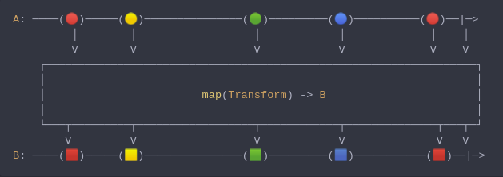

#### [CallbagKit][Callbag] › [Documentation][Documentation] › [Operators][Operators] › [Transforming][Transforming]
# Map
> A Callbag [operator][Operators] that applies a transformation on items passing
> through it. And it returns a [pullable][Sources] / [listenable][Sources] source,
> depends on the given callbag sources types.



<!-- ```swift
A: ────(🔴)─────(🟡)───────────────(🟢)─────────(🔵)──────────(🔴)──|─>
         │        │                  │            │             │    │
         ⅴ        ⅴ                  ⅴ            ⅴ             ⅴ    ⅴ
    ┌──────────────────────────────────────────────────────────────────┐
    │                                                                  │
    │                        map(Transform) -> B                       │
    │                                                                  │
    └───┬─────────┬──────────────────┬────────────┬──────────────┬───┬─┘
        ⅴ         ⅴ                  ⅴ            ⅴ              ⅴ   ⅴ
B: ────(🟥)─────(🟨)───────────────(🟩)─────────(🟦)───────────(🟥)──|─>
``` -->

**Examples**

```swift
  _ = from(1...5)
    |> map { "\($0 * 10)" }
    |> forEach(print) // "10"
                      // "20"
                      // "30"
                      // "40"
                      // "50"
```

```swift
  struct Person {
    let name: String
    let age: Int
  }

  _ = of(Person(name: "Jack", age: 42))
    |> map(\.age)
    |> forEach(print) // 42
```

```swift
  struct Person {
    let name: String
    let age: Int
  }

  _ = of(Person(name: "Jack", age: 42))
    |> map(\.age, \.name)
    |> forEach(print) // 42, "Jack")
```

[Callbag]: <../../../README.md> (Callbag)
[Documentation]: <../../README.md> (Documentation)
[Operators]: <../README.md> (Operators)
[Transforming]: <./README.md> (Transforming)

[Sources]: <../../Sources/README.md> (Sources)