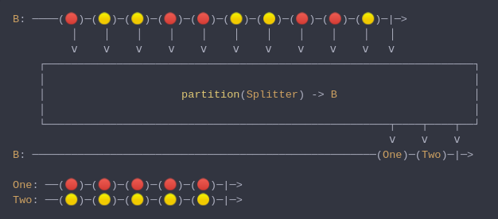

#### [CallbagKit][Callbag] › [Documentation][Documentation] › [Operators][Operators] › [Transforming][Transforming]
# Partition
> A Callbag [operator][Operators] that splits the source into two, one with values
> that satisfy a predicate, and another with values that don't satisfy the predicate.
> And it returns a [pullable][Sources] / [listenable][Sources] source, depends on
> the given callbag sources types.



<!-- ```swift
B: ────(🔴)─(🟡)─(🟡)─(🔴)─(🔴)─(🟡)─(🟡)─(🔴)─(🔴)─(🟡)─|─>
         │    │    │    │    │    │    │    │    │    │   │
         ⅴ    ⅴ    ⅴ    ⅴ    ⅴ    ⅴ    ⅴ    ⅴ    ⅴ    ⅴ   ⅴ
    ┌──────────────────────────────────────────────────────────────────┐
    │                                                                  │
    │                     partition(Splitter) -> B                     │
    │                                                                  │
    └─────────────────────────────────────────────────────┬────┬────┬──┘
                                                          ⅴ    ⅴ    ⅴ
B: ─────────────────────────────────────────────────────(One)─(Two)─|─>

One: ──(🔴)─(🔴)─(🔴)─(🔴)─(🔴)─|─>
Two: ──(🟡)─(🟡)─(🟡)─(🟡)─(🟡)─|─>
``` -->

**Examples**

```swift
  _ = from(1...10)
    |> partition { $0 % 2 == 0 }
    |> forEach(sink(print)) // next(1)
                            // next(3)
                            // next(5)
                            // next(7)
                            // next(9)
                            // completed(finished)
                            // next(2)
                            // next(4)
                            // next(6)
                            // next(8)
                            // next(10)
                            // completed(finished)
```

[Callbag]: <../../../README.md> (Callbag)
[Documentation]: <../../README.md> (Documentation)
[Operators]: <../README.md> (Operators)
[Transforming]: <./README.md> (Transforming)

[Sources]: <../../Sources/README.md> (Sources)