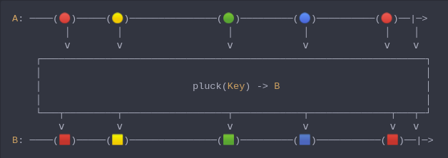

#### [CallbagKit][Callbag] › [Documentation][Documentation] › [Operators][Operators] › [Transforming][Transforming]
# Pluck
> A Callbag [operator][Operators] that maps to object properties. And it returns
> a [pullable][Sources] / [listenable][Sources] source, depends on the given
> callbag sources types.



<!-- ```swift
A: ────(🔴)─────(🟡)───────────────(🟢)─────────(🔵)──────────(🔴)──|─>
         │        │                  │            │             │    │
         ⅴ        ⅴ                  ⅴ            ⅴ             ⅴ    ⅴ
    ┌──────────────────────────────────────────────────────────────────┐
    │                                                                  │
    │                          pluck(Key) -> B                         │
    │                                                                  │
    └───┬─────────┬──────────────────┬────────────┬──────────────┬───┬─┘
        ⅴ         ⅴ                  ⅴ            ⅴ              ⅴ   ⅴ
B: ────(🟥)─────(🟨)───────────────(🟩)─────────(🟦)───────────(🟥)──|─>
``` -->

**Examples**
```swift
  let object: Dictionary<String, Any> = [
    "id": "0216958406584125",
    "info": [
      "name": "Jack",
      "age": 42
    ]
  ]

  _ = of(object)
    |> pluck("info")
    |> compact { $0 as? Dictionary<String, Any> }
    |> pluck("age")
    |> forEach(print) // 42
```

```swift
  _ = of([
      "name": "Jack",
      "age": 42
    ])
    |> pluck("age")
    |> forEach(print) // 42
```

```swift
  _ = of([
      "name": "Jack",
    ])
    |> pluck("age")
    |> forEach(print) // print nothing (aka empty)
```

```swift
  _ = of([
      ("name", "Jack"),
      ("age", "42")
    ])
    |> pluck("age")
    |> forEach(print) // 42
```

```swift
  _ = from([
      ("name", "Jack"),
      ("age", "42")
    ])
    |> pluck("age")
    |> forEach(print) // 42
```

```swift
  struct Person {
    let name: String
    let age: Int
  }

  _ = of(Person(name: "Jack", age: 42))
    |> pluck(\.age)
    |> forEach(print) // 42
```

[Callbag]: <../../../README.md> (Callbag)
[Documentation]: <../../README.md> (Documentation)
[Operators]: <../README.md> (Operators)
[Transforming]: <./README.md> (Transforming)

[Sources]: <../../Sources/README.md> (Sources)