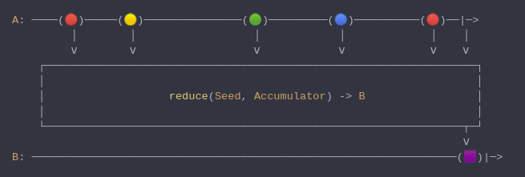

#### [CallbagKit][Callbag] › [Documentation][Documentation] › [Operators][Operators] › [Transforming][Transforming]
# Reduce
> A Callbag [operator][Operators] that combines consecutive values from the same
> source. It's essentially like array `.reduce`. And it returns a [single][Sources]
> source.



<!-- ```swift
A: ────(🔴)─────(🟡)───────────────(🟢)─────────(🔵)──────────(🔴)──|─>
         │        │                  │            │             │    │
         ⅴ        ⅴ                  ⅴ            ⅴ             ⅴ    ⅴ
    ┌──────────────────────────────────────────────────────────────────┐
    │                                                                  │
    │                   reduce(Seed, Accumulator) -> B                 │
    │                                                                  │
    └────────────────────────────────────────────────────────────────┬─┘
                                                                     ⅴ
B: ─────────────────────────────────────────────────────────────────(🟪)|─>
``` -->

**Examples**

```swift
  let source = from(1...5)

  _ = source
    |> reduce(0, +)
    |> forEach(print) // 15
```

[Callbag]: <../../../README.md> (Callbag)
[Documentation]: <../../README.md> (Documentation)
[Operators]: <../README.md> (Operators)
[Transforming]: <./README.md> (Transforming)

[Sources]: <../../Sources/README.md> (Sources)