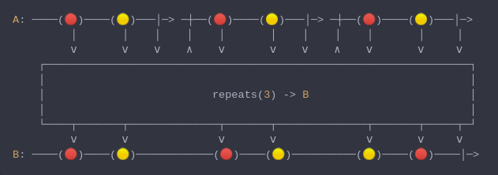

#### [CallbagKit][Callbag] › [Documentation][Documentation] › [Operators][Operators] › [Transforming][Transforming]
# Repeats
> A Callbag [operator][Operators] that repeats/restarts the source stream by repeating
> the source handshake when source stream finished without error. And it returns a
> [listenable][Sources] source.



<!-- ```swift
A: ────(🔴)────(🟡)───│─> ─┼──(🔴)────(🟡)───│─> ─┼──(🔴)────(🟡)───│─>
         │       │    │    │    │       │    │    │    │       │     │
         ⅴ       ⅴ    ⅴ    ∧    ⅴ       ⅴ    ⅴ    ∧    ⅴ       ⅴ     ⅴ
    ┌──────────────────────────────────────────────────────────────────┐
    │                                                                  │
    │                          repeats(3) -> B                         │
    │                                                                  │
    └────┬───────┬──────────────┬───────┬──────────────┬───────┬─────┬─┘
         ⅴ       ⅴ              ⅴ       ⅴ              ⅴ       ⅴ     ⅴ
B: ────(🔴)────(🟡)────────────(🔴)────(🟡)──────────(🟡)────(🔴)────│─>
``` -->

**Examples**

```swift
  _ = from(1...2)
    |> repeats(2)
    |> forEach(print) // 1
                      // 2
                      // 1
                      // 2
```

```swift
  _ = from(1...2)
    |> repeats()
    |> take(5)
    |> forEach(print) // 1
                      // 2
                      // 1
                      // 2
                      // 1
```

```swift
  _ = of()
    |> repeats()
    |> take(5)
    |> forEach(print) // print nothing (keep repeats forever)

  // to fix previous example

  _ = of()
    |> replaceEmpty(with: 0)
    |> repeats()
    |> take(5)
    |> forEach(print) // 0
                      // 0
                      // 0
                      // 0
                      // 0
```

[Callbag]: <../../../README.md> (Callbag)
[Documentation]: <../../README.md> (Documentation)
[Operators]: <../README.md> (Operators)
[Transforming]: <./README.md> (Transforming)

[Sources]: <../../Sources/README.md> (Sources)