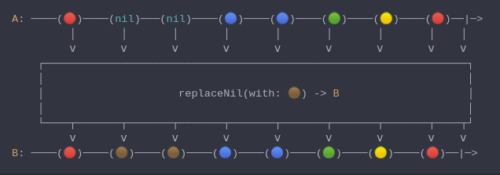
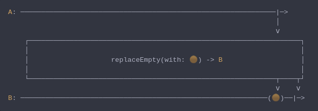
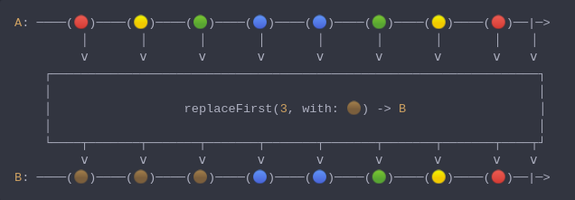
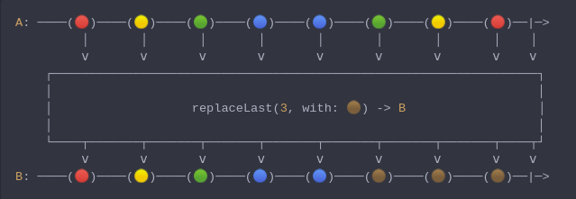
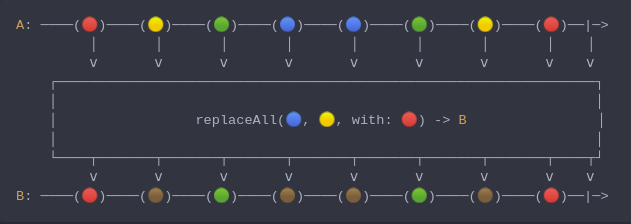

#### [CallbagKit][Callbag] › [Documentation][Documentation] › [Operators][Operators] › [Transforming][Transforming]
# Replacing
> A collection of callbag operators that will replaces values with another ones in variate ways.

- [Replacing](#replacing)
  - [ReplaceNil](#replacenil)
  - [ReplaceEmpty](#replaceempty)
  - [ReplaceFirst](#replacefirst)
  - [ReplaceLast](#replacelast)
  - [ReplaceAll](#replaceall)

---

## ReplaceNil
> A Callbag [operator][Operators] that will replace `nil` values with the given value.
> And it returns a [pullable][Sources] / [listenable][Sources] source, depends on
> the given callbag sources types.



<!-- ```swift
A: ────(🔴)────(nil)───(nil)────(🔵)────(🔵)────(🟢)────(🟡)────(🔴)──|─>
         │       │       │       │       │       │       │       │    │
         ⅴ       ⅴ       ⅴ       ⅴ       ⅴ       ⅴ       ⅴ       ⅴ    ⅴ
    ┌──────────────────────────────────────────────────────────────────┐
    │                                                                  │
    │                     replaceNil(with: 🟤) -> B                    │
    │                                                                  │
    └────┬───────┬───────┬───────┬───────┬───────┬───────┬───────┬────┬┘
         ⅴ       ⅴ       ⅴ       ⅴ       ⅴ       ⅴ       ⅴ       ⅴ    ⅴ
B: ────(🔴)────(🟤)────(🟤)────(🔵)────(🔵)────(🟢)────(🟡)────(🔴)──|─>
``` -->

**Examples**

```swift
  _ = of(1, 2, nil, 4, nil)
    |> replaceNil(with: 0)
    |> forEach(print) // 1
                      // 2
                      // 0
                      // 4
                      // 0
```

---

## ReplaceEmpty
> A Callbag [operator][Operators] that will emit the given value if source did not emit any.
> And it returns a  [listenable][Sources] source.



<!-- ```swift
A: ──────────────────────────────────────────────────────────────|─>
                                                                 │
                                                                 ⅴ
    ┌──────────────────────────────────────────────────────────────────┐
    │                                                                  │
    │                    replaceEmpty(with: 🟤) -> B                   │
    │                                                                  │
    └────────────────────────────────────────────────────────────┬────┬┘
                                                                 ⅴ    ⅴ
B: ────────────────────────────────────────────────────────────(🟤)──|─>
``` -->

**Examples**

```swift
  _ = of()
    |> replaceEmpty(with: 0)
    |> forEach(print) // 0
```

---

## ReplaceFirst
> A Callbag [operator][Operators] that will replace first n values with the given value.
> And it returns a [pullable][Sources] / [listenable][Sources] source, depends on
> the given callbag sources types.



<!-- ```swift
A: ────(🔴)────(🟡)────(🟢)────(🔵)────(🔵)────(🟢)────(🟡)────(🔴)──|─>
         │       │       │       │       │       │       │       │    │
         ⅴ       ⅴ       ⅴ       ⅴ       ⅴ       ⅴ       ⅴ       ⅴ    ⅴ
    ┌──────────────────────────────────────────────────────────────────┐
    │                                                                  │
    │                  replaceFirst(3, with: 🟤) -> B                  │
    │                                                                  │
    └────┬───────┬───────┬───────┬───────┬───────┬───────┬───────┬────┬┘
         ⅴ       ⅴ       ⅴ       ⅴ       ⅴ       ⅴ       ⅴ       ⅴ    ⅴ
B: ────(🟤)────(🟤)────(🟤)────(🔵)────(🔵)────(🟢)────(🟡)────(🔴)──|─>
``` -->

**Examples**

```swift
  _ = from(1...5)
    |> replaceFirst(2, with: 0)
    |> forEach(print) // 0
                      // 0
                      // 3
                      // 4
                      // 5
```

---

## ReplaceLast
> A Callbag [operator][Operators] that will replace last n values with the given value.
> And it returns a [listenable][Sources] source.



<!-- ```swift
A: ────(🔴)────(🟡)────(🟢)────(🔵)────(🔵)────(🟢)────(🟡)────(🔴)──|─>
         │       │       │       │       │       │       │       │    │
         ⅴ       ⅴ       ⅴ       ⅴ       ⅴ       ⅴ       ⅴ       ⅴ    ⅴ
    ┌──────────────────────────────────────────────────────────────────┐
    │                                                                  │
    │                   replaceLast(3, with: 🟤) -> B                  │
    │                                                                  │
    └────┬───────┬───────┬───────┬───────┬───────┬───────┬───────┬────┬┘
         ⅴ       ⅴ       ⅴ       ⅴ       ⅴ       ⅴ       ⅴ       ⅴ    ⅴ
B: ────(🔴)────(🟡)────(🟢)────(🔵)────(🔵)────(🟤)────(🟤)────(🟤)──|─>
``` -->

**Examples**

```swift
  _ = from(1...5)
    |> replaceLast(2, with: 0)
    |> forEach(print) // 1
                      // 2
                      // 3
                      // 0
                      // 0
```

---

## ReplaceAll
> A Callbag [operator][Operators] that will replace certain / all values with the given value.
> And it returns a [pullable][Sources] / [listenable][Sources] source, depends on
> the given callbag sources types.



<!-- ```swift
A: ────(🔴)────(🟡)────(🟢)────(🔵)────(🔵)────(🟢)────(🟡)────(🔴)──|─>
         │       │       │       │       │       │       │       │    │
         ⅴ       ⅴ       ⅴ       ⅴ       ⅴ       ⅴ       ⅴ       ⅴ    ⅴ
    ┌──────────────────────────────────────────────────────────────────┐
    │                                                                  │
    │                 replaceAll(🔵, 🟡, with: 🔴) -> B                │
    │                                                                  │
    └────┬───────┬───────┬───────┬───────┬───────┬───────┬───────┬────┬┘
         ⅴ       ⅴ       ⅴ       ⅴ       ⅴ       ⅴ       ⅴ       ⅴ    ⅴ
B: ────(🔴)────(🟤)────(🟢)────(🟤)────(🟤)────(🟢)────(🟤)────(🔴)──|─>
``` -->

**Examples**

```swift
  _ = of(1, 2, 3, 4, 5)
    |> replaceAll(with: 0)
    |> forEach(print) // 0
                      // 0
                      // 0
                      // 0
                      // 0
```

```swift
  _ = of(1, 2, 3, 4, 5)
    |> replaceAll(2, 3, with: 0)
    |> forEach(print) // 1
                      // 0
                      // 0
                      // 4
                      // 5
```

```swift
  /// replaceAll: example
  _ = of(1, 2, 3, 4, 5)
    |> replaceAll([2, 3], with: 0)
    |> forEach(print) // 1
                      // 0
                      // 0
                      // 4
                      // 5
```


[Callbag]: <../../../README.md> (Callbag)
[Documentation]: <../../README.md> (Documentation)
[Operators]: <../README.md> (Operators)
[Transforming]: <./README.md> (Transforming)

[Sources]: <../../Sources/README.md> (Sources)