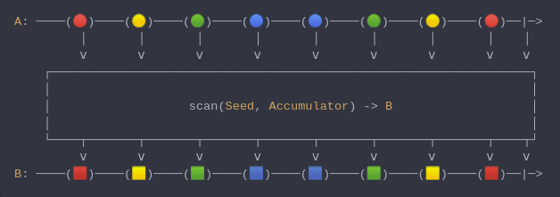

#### [CallbagKit][Callbag] › [Documentation][Documentation] › [Operators][Operators] › [Transforming][Transforming]
# Scan
> A Callbag [operator][Operators] that combines consecutive values from the same source.
> It's essentially like array `.reduce`, but delivers a new accumulated value for each
> value from the callbag source. And it returns a [pullable][Sources] / [listenable][Sources]
> source, depends on the given callbag sources types.



<!-- ```swift
A: ────(🔴)────(🟡)────(🟢)────(🔵)────(🔵)────(🟢)────(🟡)────(🔴)──|─>
         │       │       │       │       │       │       │       │    │
         ⅴ       ⅴ       ⅴ       ⅴ       ⅴ       ⅴ       ⅴ       ⅴ    ⅴ
    ┌──────────────────────────────────────────────────────────────────┐
    │                                                                  │
    │                   scan(Seed, Accumulator) -> B                   │
    │                                                                  │
    └────┬───────┬───────┬───────┬───────┬───────┬───────┬───────┬────┬┘
         ⅴ       ⅴ       ⅴ       ⅴ       ⅴ       ⅴ       ⅴ       ⅴ    ⅴ
B: ────(🟥)────(🟨)────(🟩)────(🟦)────(🟦)────(🟩)────(🟨)────(🟥)──|─>
``` -->

**Examples**

```swift
  _ = of(1, 2, 3, 4, 5)
    |> scan(+)
    |> forEach(print) // 1
                      // 3
                      // 6
                      // 10
                      // 15  
```

```swift
  _ = of(1, 2, 3, 4, 5)
    |> scan(1, +)
    |> forEach(print) // 2
                      // 4
                      // 7
                      // 11
                      // 16
```

[Callbag]: <../../../README.md> (Callbag)
[Documentation]: <../../README.md> (Documentation)
[Operators]: <../README.md> (Operators)
[Transforming]: <./README.md> (Transforming)

[Sources]: <../../Sources/README.md> (Sources)